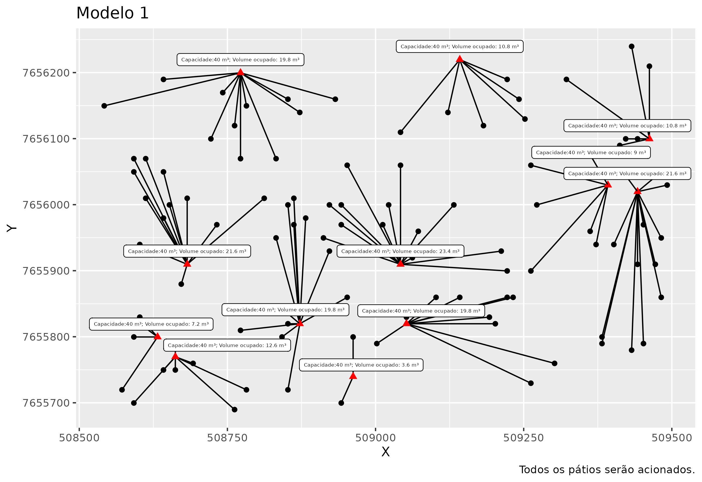
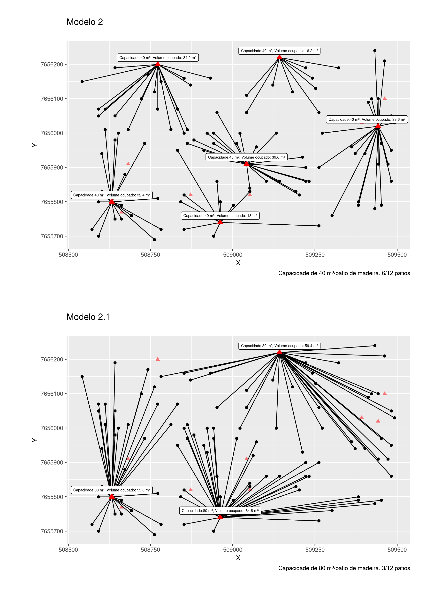
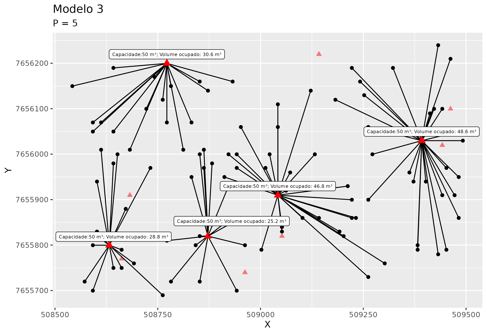

  
  
  A extração por arraste é uma etapa da colheita florestal onde as toras são transportadas da área de corte até a margem do talhão, estrada ou pátio intermediário.
  
  A distância de extração tem impacto direto nos custos da operação de colheita florestal. Quanto maior a distância entre a área de corte e o pátio de estocagem, maior é o tempo gasto e o consumo de combustível dos equipamentos de arraste, o que eleva os custos operacionais. Além disso, distâncias maiores aumentam o desgaste das máquinas e a necessidade de manutenção, além de prolongarem o ciclo de trabalho, reduzindo a produtividade da equipe.
  
  Otimizar a localização das pilhas de estocagem para minimizar essas distâncias é essencial para uma operação mais econômica e eficiente.
  
 O método da p-mediana é amplamente utilizado em problemas de localização, como a seleção de pátios de estocagem na colheita florestal, em que é necessário escolher p locais que minimizem a distância total (ou custo) entre os pontos de demanda (como áreas de corte) e os pontos de suprimento (como pátios).
 
O post a seguir é um caderno cujo o intuito foi de desenvolver e explorar novas habilidades  envolvendo a utilização de ferramentas de Geoprocessamento e de Programação Linear Inteira aplicado ao problema de otimização da localização de pilhas na colheita florestal. O custo foi calculado a partir da distância euclidiana, com o trânsito das máquinas sobre os tocos na linha de plantio não sendo incluído como restrição. 
 
Esse esforço me permitiu exercitar o aprendizado em modelagem, onde descobri ferramentas de modelagem e solvers de código aberto e livres, que permitem resolver problemas de PL sem nenhum custo. As bibliotecas ROI e OMPR possibilitam padronizar o código dos modelos já que são compatíveis com diferentes solvers, incluindo softwares proprietários. Isso foi ótimo pois não precisei reescrever o modelo para um novo código à depender do solver que estava utilizando. Apliquei o mesmo modelo nos solvers symphony e glpk e tudo funcionou bem.   
  
  
## 1)  Problema proposto
  
  A área a ser trabalhada pela equipe de planejamento florestal encontra-se localizada no projeto Ferradura, sendo selecionado apenas talhões com idade superior a 3 anos. O mapa a seguir é uma representação da área em análise, que compreende um total de 90 talhões e 4.561 ha com plantio de
Eucaliptus spp.


```{r fig1, echo=FALSE, out.width="70%", fig.align='center'}
knitr::include_graphics("./images/img_prj_ferradura.png", error = FALSE)
```


O objetivo é definir a localização e a quantidade de pátios de estocagem
necessários para a colheita de um talhão do projeto, tendo em
vista o menor custo da operação de extração por arraste.


###  Restrições 

a) Capacidade de armazenamento de madeira por pilha: 200 m³;

b) Distância mínima entre pilhas: 25 m; 

c) considere que não há restrições à instalação das pilhas de estocagem de
madeira nas bordas do talhão avaliado, e 

d) o número de pilhas de estocagem será definido pela razão entre o volume
total de madeira do talhão e a capacidade de armazenamento de madeira na
pilha, cujo resultado será acrescido de mais uma pilha. 


## 2)  Preparando os dados 


```{r bibliotecas, include=TRUE, echo=TRUE, eval=TRUE, message=FALSE, warning=FALSE}
library(sf)
library(rgdal)
library(spatialEco)
# library(rgeos)
library(tidyr)
library(dplyr)
library(raster)
library(terra)
library(igraph)
library(ggplot2)
```

###  Área do projeto


```{r area_projeto, include=TRUE, echo=TRUE, eval=TRUE, message=FALSE, warning=FALSE, results= FALSE}

prj <-
  st_read("/home/vinicio/Documentos/PCF-508/PESQUISA OPERACIONAL PCF-508 VINICIO LIMA/P_Mediana/Dados/Projeto.ferradura.shp")
prj$Sitio <- paste0('S', prj$Sitio)
prj <- prj %>% filter(idade > 3)


```


###  Idade e sítio

```{r idade_sitio, include=TRUE, echo=TRUE, eval=TRUE, message=FALSE, warning=FALSE}

tabela_1 = data.frame(
  Idade = c(4, 5, 6, 7, 8, 9, 10),
  S1 = c(250, 300, 348, 394, 439, 483, 526),
  S2 = c(200, 240, 278, 316, 352, 387, 421),
  S3 = c(180, 216, 251, 284, 316, 348, 379)
)

tabela_1 = tabela_1 %>% pivot_longer(
  cols = c('S1', 'S2', 'S3'),
  names_to = 'Sitio',
  values_to = "Volume"
)


```


###  Quantidade de pilhas por talhão


```{r pilhas_talhao, include=TRUE, echo=TRUE, eval=TRUE, message=FALSE, warning=FALSE}

prj_c <- left_join(prj, tabela_1, by = c("Sitio" = "Sitio", "idade" = "Idade")) %>%
  mutate(n_pilhas = round((Volume * area / 200) + 1))

prj_c[1:4,] # prj_c = projeto colheita 

```


### Selecionar um talhão


```{r seleciona_talhao, include=TRUE, echo=TRUE, eval=TRUE, message=FALSE, warning=FALSE}

# prj_t = prj_c %>% sample_n(1)
prj_t = prj_c %>% filter(Talhao == 67) # prj_t = talhao  selecionado
prj_t %>% st_drop_geometry()

```


### Definindo a área que uma pilha vai ocupar no talhão - 25m x 25m

#### Alocando as pilhas de madeira na borda do talhão


```{r alocar_pilhas, include=TRUE, echo=TRUE, eval=TRUE, message=FALSE, warning=FALSE}

r <- rast(ext(prj_t), res = 10) 
rast <- rasterize(vect(prj_t), r, values=1, background=0)
r2 = raster(rast)
crs(r2) <- "+proj=utm +zone=23 +south +ellps=aust_SA +units=m +no_defs" 

perimetro <- prj_t %>% st_cast(to = "LINESTRING")
r3 <- rast(ext(prj_t),
           nrow = 23,
           ncol = 39,
           res = 25)


per <- raster(rasterize(
  vect(perimetro),
  r3,
  values = 1,
  background = 0,
  touches = TRUE
))


tbl_per = rasterToPolygons(
  per,
  fun = NULL,
  n = 4,
  na.rm = TRUE,
  digits = 12,
  dissolve = FALSE
) %>% st_as_sf()

# filtra somente bordadura
tbl_1 = tbl_per %>% filter(layer == 1) 
st_crs(tbl_1) <- "+proj=utm +zone=23 +south +ellps=aust_SA +units=m +no_defs" 


```


#### Garantindo a distância de 25m entre pilhas. 


```{r distancia_pilhas, include=TRUE, echo=TRUE, eval=TRUE, message=FALSE, warning=FALSE}

my_graph <- graph_from_adj_list(st_touches(tbl_1)) # input perimetro grid 25x25

id_to_be_ignored <- ego(my_graph, order = 1, nodes = 1)[[1]]
all_second_order_neighbours <- ego(my_graph, order = 2, nodes = 1)[[1]]
final_sample <- difference(all_second_order_neighbours, id_to_be_ignored)

i <- 1
while (TRUE) {
  if (i > length(final_sample)) break
  id <- final_sample[[i]]
  ego1_id <- ego(my_graph, order = 1, nodes = id)[[1]]
  id_to_be_ignored <- union(id_to_be_ignored, difference(ego1_id, V(my_graph)[id]))
  ego2_id <- difference(ego(my_graph, order = 2, nodes = id)[[1]],  ego1_id )
  
  final_sample <- difference(union(final_sample, ego2_id), id_to_be_ignored)
  i <- i + 1
}

pilhas = tbl_1[c(1, as.integer(final_sample)), ]

```


### Parcelas do talhão - Grid 10m x 10m


```{r grid_talhao, include=TRUE, echo=TRUE, eval=TRUE, message=FALSE, warning=FALSE}

r.grid <- rast(ext(prj_t), res = 10) 
tal <- raster(rasterize(vect(prj_t), r.grid, values=1, background=0, touches = FALSE))
tal_mask = mask(tal, prj_t)
tal_mask[!is.na(tal_mask)][] <- 0

x = rasterToPolygons(
  tal_mask, fun = NULL, n = 4,  na.rm = TRUE,  digits = 12,  dissolve = FALSE
)  %>% st_as_sf()
st_crs(x) <- "+proj=utm +zone=23 +south +ellps=aust_SA +units=m +no_defs"

```


### Distribuição das pilhas no talhão selecionado

```{r distribui_pilhas, include=TRUE, echo=TRUE, eval=TRUE, message=FALSE, out.width = '90%', warning=FALSE}

pilhas_point = st_centroid(pilhas)
x_point = st_centroid(x)

plot(st_geometry(st_centroid(x_point)),
     pch = 3,  col = 'black', cex = 2. ,  axes = TRUE,
     main = "Distribuição das pilhas no talhão (T67)", 
     sub = ""
)

plot(st_geometry(pilhas_point),pch = 24,  cex = 1.5,  col = "blue",
     bg = "red",  lwd = 1 ,
     add = TRUE
)

```


## 3) Reduzindo o problema 

Exemplo simplificado para abstração do problema a partir de um subset dos dados originais. O objetivo é testar e validar a funcionalidade do modelo em uma escala menor.


### Amostragem aleatória

Problema reduzido contendo 100 parcelas e 12 pátios de estocagem. 


```{r reduz_problema, include=TRUE, echo=TRUE, eval=TRUE, message=FALSE, warning=FALSE}

rownames(x_point) <- as.integer(row.names(x_point))
x_point$point_name <- as.integer(row.names(x_point))

```


```{r reduz_sample, include=TRUE, echo=TRUE, eval=FALSE, message=FALSE, warning=FALSE}

grids =  subsample.distance(
as(x_point, "Spatial"), # SpatialEco agora recebe objeto sf
  x_point,
  size = 100, d = 10) # %>% st_as_sf() # 100 parcelas 

pil  = subsample.distance(
as(st_crop(  x_point, st_bbox(grids)), "Spatial"), # SpatialEco agora recebe objeto sf
st_crop(  x_point, st_bbox(grids)),
size = 12, d = 25) # %>%  st_as_sf() # 12 pátios


```


```{r reduz_sample_2, include=TRUE, echo=FALSE, eval=TRUE, message=FALSE, warning=FALSE}

#paste(as.integer(rownames(grids)), collapse = ",")
grids.sample <- c(
  2385,
  598,
  4180,
  3480,
  4005,
  1123,
  1195,
  4492,
  1419,
  3034,
  4142,
  2086,
  753,
  2005,
  3518,
  2516,
  2123,
  2413,
  3718,
  2742,
  1879,
  2589,
  624,
  2739,
  3492,
  3112,
  1565,
  3493,
  3874,
  3763,
  318,
  2148,
  2398,
  173,
  4281,
  1600,
  452,
  648,
  1425,
  3927,
  1985,
  250,
  2545,
  3108,
  887,
  1595,
  4801,
  3245,
  4460,
  2597,
  4399,
  3814,
  4042,
  559,
  4773,
  2113,
  2819,
  4745,
  4084,
  2106,
  2654,
  2010,
  3037,
  778,
  26,
  2134,
  976,
  1058,
  4108,
  2279,
  3777,
  2303,
  2662,
  2406,
  934,
  1543,
  1534,
  4187,
  1289,
  4794,
  2900,
  1992,
  4030,
  1403,
  3667,
  4954,
  3465,
  2115,
  1401,
  4919,
  567,
  2457,
  4981,
  1193,
  3839,
  308,
  4490,
  3484,
  1684,
  2790
)

# paste(as.integer(rownames(pil)), collapse = ",")
pil.sample <-
  c(4300, 3859, 1197, 2994, 177, 4618, 4009, 80, 2958, 3841, 1869, 1971)


grids =  #subsample.distance(
  # as(x_point, "Spatial"), # SpatialEco agora recebe objeto sf
  filter(x_point, x_point$point_name %in% grids.sample)
  #size = 100, d = 10) # %>% st_as_sf() # 100 parcelas 

pil  = #subsample.distance(
  # as(st_crop(  x_point, st_bbox(grids)), "Spatial"), # SpatialEco agora recebe objeto sf
  filter(x_point, x_point$point_name %in% pil.sample) %>% 
  st_crop( st_bbox(grids))# %>%  st_as_sf() # 12 pátios


```


```{r plot_reduz_problema, include=TRUE, echo=TRUE, eval=TRUE, message=FALSE, out.width = '80%', warning=FALSE}

plot(st_geometry(st_centroid(grids)), pch = 3, col = 'black', cex= 2. , axes = TRUE, 
     main = "Exemplo hipotético para modelagem do problema")
plot(st_geometry(pil), pch = 24, cex=3, col="blue", bg="red", lwd=2,   add = TRUE )

```


## 4) Matriz de custo

Distância euclidiana entre as parcelas (grids) e os pátios. 

```{r matriz_custo, include=TRUE, echo=TRUE, eval=TRUE, message=FALSE, warning=FALSE}

# Obsoleto - rgeos
# cost =  rgeos::gDistance(as(pil, "Spatial"),
#                          as(grids, "Spatial") , byid = TRUE) 

cost = st_distance(pil, grids)
cost[1:3,1:1 ] %>% t()

```


### Tabelas para plotagem

```{r tabelas_plotagem, include=TRUE, echo=TRUE, eval=TRUE, message=FALSE, warning=FALSE}

grids$id <- 1:nrow(grids)
grids$id_grid <- grids$id
grids$grids_name <- rownames(grids)
XY.grids <-  st_coordinates(grids)
grids <- grids %>% mutate(X_g = XY.grids[, 1],
                          Y_g = XY.grids[,2] )
grids <- cbind(grids, XY.grids) %>% st_drop_geometry()

pil$id <- 1:nrow(pil)
pil$id_pil <- pil$id
pil$pil_name <- rownames(pil)
XY.pil <-  st_coordinates(pil)
pil <- pil %>% mutate(X_p = XY.pil[, 1],
                      Y_p = XY.pil[,2] )
pil <- cbind(pil, XY.pil) %>% st_drop_geometry()

```


## 5) Ferramentas de modelagem e Solvers

### OMPR

OMPR (Optimization Modeling Package) é uma DSL para modelar e resolver
programas lineares inteiros mistos. É inspirado no projeto Jump em
Julia. (Fonte:  https://dirkschumacher.github.io/ompr/)


```{r ompr, include=TRUE, echo=TRUE, eval=TRUE, message=FALSE, warning=FALSE}

library(ompr)

```


### ROI

O pacote R Optimization Infrastructure ([ROI](https://roi.r-forge.r-project.org/index.html))
fornece uma infraestrutura extensível para modelar problemas de otimização
linear, quadrática, cônica e geral de maneira consistente. (Fonte: https://roi.r-forge.r-project.org/index.html)

```{r roi, include=TRUE, echo=TRUE, eval=TRUE, message=FALSE, warning=FALSE}

library(ROI)
library(ompr.roi)

```


O ROI fornece os recursos de modelagem e gerencia os plug-ins. Os plug-ins
adicionam os solucionadores ao ROI. Entre os solvers disponíveis estão 
**Gurobi**, **LPSolve**, **Symphony** e **glpk**.

 
```{r roi_solvers, include=TRUE, echo=TRUE, eval=TRUE, message=FALSE, warning=FALSE}

plugins <- ROI_available_solvers()[,c("Package", "Repository")]
plugins <- aggregate(Repository ~ Package,  data = plugins, 
                     FUN = paste, collapse = ", ")
knitr::kable(plugins, row.names = TRUE)
```


### Symphony 

O SYMPHONY é um solver MILP genérico de código aberto, de estrutura
extensível para implementação de solucionadores personalizados para programação
linear inteira mista (MILPs). (Fonte: https://github.com/coin-or/SYMPHONY)


```{r roi_symphony, include=TRUE, echo=TRUE, eval=TRUE, message=FALSE, warning=FALSE}

library(ROI.plugin.symphony)

```


### Modelo 1 - Custo fixo 

Atribiu uma parcela para cada pátio. Não leva em consideração a diferença de custo para ativar os pátios. 

```{r espec_modelo_1, include=TRUE, echo=TRUE, eval=FALSE, message=FALSE, warning=FALSE}


num_depots = nrow(pil)
num_cust = nrow(grids)
custo.fixo = 10  # arbitrário pra todos os pátios # Custo para ativar um pátio # 
volume.t = prj_t$area * prj_t$Volume 
demanda <- volume.t/((prj_t$area)/(res(r.grid)[1]^2/10000))
capacidade <- 40 # arbitrário # Capacidade do pátio de estocagem

cost <- matrix(cost, num_depots, num_cust )
demand = rep(demanda, nrow(grids))
fixedcost =  rep(custo.fixo, nrow(pil))
capacity = rep(capacidade, nrow(pil))

```


```{r modelo_1, include=TRUE, echo=TRUE, eval=FALSE, message=FALSE, warning=FALSE}

m <- MIPModel() %>%
  add_variable(ship[i, j],
               i = 1:num_depots,
               j = 1:num_cust,
               type = "binary") %>%
  add_constraint(sum_expr(demand[j] * ship[i, j], j = 1:num_cust) <= capacity[i],
                 i = 1:num_depots) %>%
  add_constraint(sum_expr(ship[i, j], i = 1:num_depots) == 1, j = 1:num_cust) %>%
  set_objective(sum_expr(cost[i, j] * ship[i, j], i = 1:num_depots, j =
                           1:num_cust), "min") %>%
  solve_model(with_ROI(solver = "symphony", verbosity = 1))

cat("Status:",solver_status(m),"\n")
cat("Objective:",objective_value(m),"\n")
matchs <- get_solution(m,ship[i, j]) %>%
  filter(value > 0) %>% as.data.frame()


```


```{r plotbase, include=TRUE, echo=TRUE, eval=FALSE, message=FALSE, warning=FALSE}

p <- ggplot(grids, aes( X , Y)) + 
  geom_point() + 
  geom_point(data = pil, color = "red", alpha = 0.5, shape = 17, size= 2) 

plot_assignment = matchs %>% 
  inner_join(grids, by = c("j" = "id")) %>% 
  inner_join(pil, by = c("i" = "id"))

grids_count <- plot_assignment %>% group_by(pil_name) %>% summarise(n = n()) 

grids_count # Total de atribuições


```


```{r plot_mod_1, include=TRUE, echo=TRUE, eval=FALSE, message=FALSE, warning=FALSE}

plot_pilhas<- pil %>% 
  mutate(costs = capacity) %>% 
  inner_join(grids_count, by = "pil_name") %>% 
  filter(id %in% unique(matchs$i)) %>% mutate(total = n*demanda)

P_mod1 <- p +
  geom_segment(data = plot_assignment,
               aes(
                 x = X.y,
                 y = Y.y,
                 xend = X.x,
                 yend = Y.x
               ),
               lwd = .2) +
  
  geom_point(
    data  = plot_pilhas,
    color = "red",
    size = 2,
    shape = 17
  ) +
  
  ggrepel::geom_label_repel(
    data  = plot_pilhas,
    aes(
      label = paste0("Capacidade:", costs, " m³", "; Volume ocupado: ", total, " m³")
    ),
    size = 1.5,
    nudge_y = 20
  ) +
  
  labs(title = "Modelo 1",
       subtitle =  "Não considera nenhuma restrição de custo para ativação de um determinado pátio.
       \n Todos os pátios serão acionados.")


ggplot2::ggsave("./plot/P_mod_1.png", P_mod1, width = 8, height = 5.5, device = "png")

```


```{r saida_plot_mod_1, include=TRUE, echo=FALSE, eval=TRUE, message=FALSE, warning=FALSE, out.width = '110%', fig.align='center', fig.pos="H" }




```


### Modelo 2 - Custo variável

Insere a restrição de custo para ativação de um determinado pátio/pilha.

Na prática força o modelo a ativar os pátios de menor custo e que correspondem 
ao menor custo total.


```{r m2_custo_variavel, include=TRUE, echo=TRUE, eval=FALSE, message=FALSE, warning=FALSE, out.width = '110%', fig.align='center', fig.pos="H" }

# Custo para ativação dos pátios. 
v_cost = c(10, 800, 50000, 1000, 300, 3000, 500, 2000, 600, 10, 400, 10) # Variável 


m2 <- MIPModel() %>%
  add_variable(ship[i, j],
               i = 1:num_depots,
               j = 1:num_cust,
               type = "binary") %>%
  add_variable(y[i],  i = 1:num_depots, type = "binary") %>%
  add_constraint(sum_expr(demand[j] * ship[i, j],  j = 1:num_cust) <= capacity[i],
                 i = 1:num_depots) %>%
  add_constraint(sum_expr(ship[i, j], i = 1:num_depots) == 1, j = 1:num_cust) %>%
  set_objective(
    sum_expr(cost[i, j] * ship[i, j], i = 1:num_depots, j = 1:num_cust) +
      sum_over(v_cost[i] * y[i], i = 1:num_depots),
    "min"
  ) %>%
  add_constraint(ship[i, j] <= y[i], i = 1:num_depots, j = 1:num_cust) %>%
  solve_model(with_ROI(solver = "symphony", verbosity = 1))


cat("Status:", solver_status(m2), "\n")
# Status: success 
cat("Objective:", objective_value(m2), "\n")
# Objective: 14454 
matchs <- get_solution(m2, ship[i, j]) %>%
  filter(value > 0) %>% as.data.frame()


```


```{r _plot_mod_2, include=TRUE, echo=TRUE, eval=FALSE, message=FALSE, warning=FALSE, out.width = '110%', fig.align='center', fig.pos="H" }


plot_assignment = matchs %>%
  inner_join(grids, by = c("j" = "id")) %>%
  inner_join(pil, by = c("i" = "id"))

grids_count <-
  plot_assignment %>% group_by(pil_name) %>% summarise(n = n()) 


```


#### Total de atribuições Modelo 2


```{r atribuicoes_mod_2, include=TRUE, echo=TRUE, eval=FALSE, message=FALSE, warning=FALSE, out.width = '110%', fig.align='center', fig.pos="H" }


grids_count

A tibble: 6 × 2
pil_name       n
  <chr>       <int>
 1 1557        18
 2 2837        14
 3 3450        22
 4 4459        12
 5 542         17
 6 755         17


```


```{r plot_mod_2, include=TRUE, echo=TRUE, eval=FALSE, message=FALSE, warning=FALSE, out.width = '110%', fig.align='center', fig.pos="H" }


plot_pilhas <- pil %>%
  mutate(costs = capacity) %>%
  inner_join(grids_count, by = "pil_name") %>%
  filter(id %in% unique(matchs$i)) %>% mutate(total = n * demanda)

p2a = p +
  geom_segment(data = plot_assignment, aes(
    x = X.y,
    y = Y.y,
    xend = X.x,
    yend = Y.x
  )) +
  geom_point(
    data  = plot_pilhas,
    color = "red",
    size = 3,
    shape = 17
  ) +
  ggrepel::geom_label_repel(
    data  = plot_pilhas,
    aes(
      label = paste0("Capacidade:", costs, " m³", "; Volume ocupado: ", total, " m³")
    ),
    size = 2,
    nudge_y = 20
  ) + 
  
  labs(title = "Modelo 2", 
       subtitle =  "")

#p2a

ggplot2::ggsave(
  filename = "./plot/plot_Mod_2.png",
  plot = p2a,
  width = 8,
  height = 5.5,
  device = "png"
)


```

Em vermelho claro os pátios que não foram acionados em função do maior custo para ativação. Na prática esse modelo pode representar situações onde a região disponível para alocação de um pátio ou pilha de madeira pretende ser evitada. Por exemplo, maior custo para adequação de estradas, locais de maior risco para operação ou evitar o impacto em locais próximos a ambientes sensíveis (áreas de preservação).

```{r saida_plot_mod_2, include=TRUE, echo=FALSE, eval=TRUE, message=FALSE, warning=FALSE, out.width = '110%', fig.align='center', fig.pos="H" }


knitr::include_graphics("./images/plot_Mod_2A.png")

```


### Modelo 2.1

Altera a capacidade para 80 m³ por pátio de madeira afim de comparar a sensibilidade do modelo para definir a ativação dos pátios em função da capacidade e custo.


```{r mod_2b_espec, include=TRUE, echo=TRUE, eval=FALSE, message=FALSE, warning=FALSE, out.width = '110%', fig.align='center', fig.pos="H" }


capacidade <- 80 # Capacidade do pátio de estocagem
capacity = rep(capacidade, nrow(pil))
cost <- matrix(cost/1000, num_depots, num_cust ) # custo em km


```


```{r solv_mod2b, include=TRUE, echo=TRUE, eval=FALSE, message=FALSE, warning=FALSE, out.width = '110%', fig.align='center', fig.pos="H" }


m2b <- MIPModel() %>%
  add_variable(ship[i, j],
               i = 1:num_depots,
               j = 1:num_cust,
               type = "binary") %>%
  add_variable(y[i],  i = 1:num_depots, type = "binary") %>%
  add_constraint(sum_expr(demand[j] * ship[i, j],  j = 1:num_cust) <= capacity[i],
                 i = 1:num_depots) %>%
  add_constraint(sum_expr(ship[i, j], i = 1:num_depots) == 1, j = 1:num_cust) %>%
  set_objective(
    sum_expr(cost[i, j] * ship[i, j], i = 1:num_depots, j = 1:num_cust) +
      sum_over(v_cost[i] * y[i], i = 1:num_depots),
    "min"
  ) %>%
  add_constraint(ship[i, j] <= y[i], i = 1:num_depots, j = 1:num_cust) %>%
  solve_model(with_ROI(solver = "symphony", verbosity = 1))


cat("Status:",solver_status(m2b),"\n")
# Status: success 

cat("Objective:",objective_value(m2b),"\n")
# Objective: 54.003  

matchs <- get_solution(m2b,ship[i, j]) %>%
  filter(value > 0) %>% as.data.frame()

```


```{r mod_2b_pre_plot, include=TRUE, echo=TRUE, eval=FALSE, message=FALSE, warning=FALSE, out.width = '110%', fig.align='center', fig.pos="H" }

plot_assignment = matchs %>% 
  inner_join(grids, by = c("j" = "id")) %>% 
  inner_join(pil, by = c("i" = "id"))


grids_count <- plot_assignment %>% group_by(pil_name) %>% summarise(n = n()) 


```


#### Total de atribuições do modelo (2.1) 


```{r mod_2b_atribuicoes, include=TRUE, echo=TRUE, eval=FALSE, message=FALSE, warning=FALSE, out.width = '110%', fig.align='center', fig.pos="H" }

grids_count

 A tibble: 3 × 2
 pil_name      n
 <chr>       <int>
  1           33
  10          31
  12          36


```


```{r mod_2b_plot, include=TRUE, echo=TRUE, eval=FALSE, message=FALSE, warning=FALSE, out.width = '110%', fig.align='center', fig.pos="H" }

plot_pilhas<- pil %>% 
  mutate(costs = capacity) %>% 
  inner_join(grids_count, by = "pil_name") %>% 
  filter(id %in% unique(matchs$i)) %>% mutate(total = n*demanda)


p2b = p +
  geom_segment(data = plot_assignment, aes(
    x = X.y,
    y = Y.y,
    xend = X.x,
    yend = Y.x
  )) +
  geom_point(
    data  = plot_pilhas,
    color = "red",
    size = 3,
    shape = 17
  ) +
  ggrepel::geom_label_repel(
    data  = plot_pilhas,
    aes(
      label = paste0("Capacidade:", costs, " m³", "; Volume ocupado: ", total, " m³")
    ),
    size = 2,
    nudge_y = 20
  ) +
    labs(title = "Modelo 2.1", 
       subtitle =  "", 
       caption = "Capacidade de 80 m³/pilha. 3/12 pilhas")


ggplot2::ggsave(
  filename = "./plot/plot_Mod_2B.png",
  plot = p2b,
  width = 8,
  height = 5.5,
  device = "png"
)


```


```{r mod_2b_plot_fig, include=TRUE, echo=FALSE, eval=TRUE, message=FALSE, warning=FALSE, out.width = '110%', fig.align='center', fig.pos="H" }

knitr::include_graphics("./images/plot_Mod_2B.png")

```


```{r plot_2a_2b, include=TRUE, echo=TRUE, eval=FALSE, message=FALSE, warning=FALSE, out.width = '90%', fig.align='center', fig.pos="H" }

library(cowplot)
png_plot_p2a <- cowplot::ggdraw() + cowplot::draw_image("./plot/plot_Mod_2A.png", scale = 0.9)
png_plot_p2b <- cowplot::ggdraw() + cowplot::draw_image("./plot/plot_Mod_2B.png", scale = 0.9)
grid_MOD_2AB <- cowplot::plot_grid(png_plot_p2a ,png_plot_p2b , labels = "", nrow=2)

ggsave(filename = "./plot/plot_Mod_2AB.png",
       plot = grid_MOD_2AB,  width = 7.5,  height = 10, device = "png")

```


```{r plot_fig_2a_2b, include=TRUE, echo=FALSE, eval=TRUE, message=FALSE, warning=FALSE, out.width = '85%', fig.align='center', fig.pos="H" }



```


### Modelo 3 P-Mediana

Adiciona a restrição de quantidade de pátios que serão ativados, valor de P. Testando o modelo para 5 pátios. 


```{r mod_3, include=TRUE, echo=TRUE, eval=FALSE, message=FALSE, warning=FALSE }

capacidade <- 50 # Capacidade das pilhas de estocagem em m³
capacity = rep(capacidade, nrow(pil))
cost <- matrix(cost, num_depots, num_cust) # matriz de custo - dist. 

```


```{r solv_mod_3, include=TRUE, echo=TRUE, eval=FALSE, message=FALSE, warning=FALSE }

m3 <- MIPModel() %>%
  add_variable(ship[i, j],
               i = 1:num_depots,
               j = 1:num_cust,
               type = "binary") %>%
  add_variable(y[i],  i = 1:num_depots, type = "binary") %>%
  add_constraint(sum_expr(demand[j] * ship[i, j],  j = 1:num_cust) <= capacity[i],
                 i = 1:num_depots) %>%
  add_constraint(sum_expr(ship[i, j], i = 1:num_depots) == 1, j = 1:num_cust) %>%
  set_objective(
    sum_expr(cost[i, j] * ship[i, j], i = 1:num_depots, j = 1:num_cust) +
      sum_over(v_cost[i] * y[i], i = 1:num_depots),
    "min"
  ) %>%
  add_constraint(ship[i, j] <= y[i], i = 1:num_depots, j = 1:num_cust) %>%
  add_constraint(sum_expr(y[i],   i = 1:num_depots) <= 5) %>%  # Valor de P
  solve_model(with_ROI(solver = "symphony", verbosity = 1))

cat("Status:",solver_status(m3),"\n")
cat("Objective:",objective_value(m3),"\n")

matchs_m3 <- get_solution(m3,ship[i, j]) %>%
  filter(value > 0) %>% as.data.frame()

```


```{r solv_mod_3_result, include=TRUE, echo=TRUE, eval=FALSE, message=FALSE, warning=FALSE }

plot_assignment_m3 = matchs_m3 %>% 
  inner_join(grids, by = c("j" = "id")) %>% 
  inner_join(pil, by = c("i" = "id"))

grids_count_m3 <- plot_assignment_m3 %>% group_by(pil_name) %>% summarise(n = n()) 

```

#### Total de atribuições Modelo 3

```{r solv_mod_3_atribuic, include=TRUE, echo=TRUE, eval=FALSE, message=FALSE, warning=FALSE }

grids_count_m3 

 A tibble: 5 × 2
  pil_name     n
  <chr>    <int>
   10       16
   2        17
   4        27
   7        26
   8        14


```


```{r solv_mod_3_plot, include=TRUE, echo=TRUE, eval=FALSE, message=FALSE, warning=FALSE }

plot_pilhas_m3 <- pil %>% 
  mutate(costs = capacity) %>% 
  inner_join(grids_count_m3, by = "pil_name") %>% 
  filter(id %in% unique(matchs_m3$i)) %>% mutate(total = n*demanda)

p_m3 <- p +
  geom_segment(data = plot_assignment_m3, aes(
    x = X.y,
    y = Y.y,
    xend = X.x,
    yend = Y.x
  )) +
  geom_point(
    data  = plot_pilhas_m3,
    color = "red",
    size = 3,
    shape = 17
  ) +
  ggrepel::geom_label_repel(
    data  = plot_pilhas_m3,
    aes(
      label = paste0("Capacidade:", costs, " m³", "; Volume ocupado: ", total, " m³")
    ),
    size = 2,
    nudge_y = 20
  ) + 
  
  labs(title = "Modelo 3 ", 
       subtitle =  "P = 5")

ggsave(filename = "./plot/plot_Mod_3.png",
       plot = p_m3,
       width = 7.5,
       height = 10,
       device = "png"
)


```


```{r plot_fig_mod3, include=TRUE, echo=FALSE, eval=TRUE, message=FALSE, warning=FALSE, out.width = '110%', fig.align='center', fig.pos="H" }



```


## 6) Retorna ao problema original 

Após validar o comportamento dos modelos podemos aplicar o modelo da p-mediana para
minimizar o custo da extração por arraste no talhão 67 do projeto Ferradura.

O talhão foi dividido em parcelas (grids) de 10m x 10m e um total de 55 pilhas 
distribuídas nas bordas do talhão, com a distância mínima de 25m entre as pilhas (item 2 - Preparando os dados). 

A quantidade de pilhas estipulada pela área de planejamento foi de 46 + 1 pilha. 

```{r retoma_probl_origin, include=TRUE, echo=TRUE, eval=FALSE, message=FALSE, warning=FALSE }

grids =  x_point 
pil  = pilhas_point

# rgeos - obsoleto
# cost =  rgeos::gDistance(as(pil, "Spatial"), as(grids, "Spatial") , byid = TRUE)
# cost <- cost %>% t() %>% as.vector() %>% round()

cost = st_distance(pil, grids)
cost <- cost %>% as.vector() %>% round()

num_depots = nrow(pil)
num_cust = nrow(grids)
custo.fixo = 10 # Custo para ativar um pátio
volume.t = prj_t$area * prj_t$Volume 
demanda <- volume.t/((prj_t$area)/(res(r.grid)[1]^2/10000))# Demanda em m³ de uma parcela
capacidade <- 200 # Capacidade dos pátios de estocagem original do problema 

cost <- matrix(cost, num_depots, num_cust )
demand = rep(demanda, nrow(grids))
fixedcost =  rep(custo.fixo, nrow(pil))
capacity = rep(capacidade, nrow(pil))
p = prj_t$n_pilhas + 1 # restrição (d) do problema

```


### Modelo 


```{r modelo_probl_origin, include=TRUE, echo=TRUE, eval=FALSE, message=FALSE, warning=FALSE }

m_pvalue <- MIPModel() %>%
  add_variable(ship[i, j],
               i = 1:num_depots,
               j = 1:num_cust,
               type = "binary") %>% # ok
  add_variable(y[i],  i = 1:num_depots, type = "binary") %>%
  add_constraint(sum_expr(demand[j] * ship[i, j],  j = 1:num_cust) <= capacity[i],
                 i = 1:num_depots) %>% # ok
  add_constraint(sum_expr(ship[i, j], i = 1:num_depots) == 1, j = 1:num_cust) %>%
  set_objective(
    sum_expr(cost[i, j] * ship[i, j], i = 1:num_depots, j = 1:num_cust) +
      sum_over(fixedcost[i] * y[i], i = 1:num_depots),
    "min"
  ) %>%
  add_constraint(ship[i, j] <= y[i], i = 1:num_depots, j = 1:num_cust) %>%
  add_constraint(sum_expr(y[i],   i = 1:num_depots) <= p) %>%
  solve_model(with_ROI(solver = "symphony", verbosity = 1))

cat("Status:",solver_status(m_pvalue),"\n")
cat("Objective:",objective_value(m_pvalue),"\n")
matchs <- get_solution(m_pvalue,ship[i, j]) %>%
  filter(value > 0) %>% as.data.frame()

```

Infelizmente o tempo de processamento foi muito longo..... :/


A saída encontrada foi reduzir a quantidade de parcelas e o número de pilhas para obter uma solução em 
um tempo razoável. 


```{r reduz_res_probl_origin, include=TRUE, echo=TRUE, eval=TRUE, message=FALSE, warning=FALSE }

# Grids

r.grid <- rast(ext(prj_t), res = 50) 
tal <- raster(rasterize(vect(prj_t), r.grid, values=1, background=0, touches = FALSE))
tal_mask = mask(tal, prj_t)
tal_mask[!is.na(tal_mask)][] <- 0

x = rasterToPolygons(
  tal_mask,
  fun = NULL,
  n = 4,
  na.rm = TRUE,
  digits = 12,
  dissolve = FALSE
)  %>% st_as_sf()

st_crs(x) <- "+proj=utm +zone=23 +south +ellps=aust_SA +units=m +no_defs"
x_point = st_centroid(x)

grids <- x_point

# Pilhas 

pil  = pilhas_point
pil  = subsample.distance(
  # as(pil, "Spatial"), # SpatialEco agora recebe objeto sf
  pil,
  size = 23, d = 100) %>%  st_as_sf() # 23 pilhas


# Plot

plot(st_geometry(st_centroid(grids)), pch = 3, col = 'black', cex= 2, axes = TRUE,
     main = "196 Parcelas e 23 pilhas")
plot(st_geometry(pil), pch = 24, cex=3, col="blue", bg="red", lwd=2, add = TRUE )

```


Dado o novo cenário considerei a capacidade de 750 m³ por pilha e que a decisão tomada
pela equipe de planejamento florestal foi de ativar 15 das 23 pilhas possíveis (valor de P = 15). 


```{r resolve_probl_origin, include=TRUE, echo=TRUE, eval=FALSE, message=FALSE, warning=FALSE }


# rggeos - Obsoleto
# cost =  rgeos::gDistance(as(pil, "Spatial"), as(grids, "Spatial") , byid = TRUE) 
# cost <- cost %>% t() %>% as.vector() %>% round()

cost = st_distance(pil, grids)
cost <- cost %>% as.vector() %>% round()

num_depots = nrow(pil)
num_cust = nrow(grids)
custo.fixo = 10 # Custo para ativar um pátio
volume.t = prj_t$area * prj_t$Volume 
demanda <- volume.t/((prj_t$area)/(res(r.grid)[1]^2/10000)) # Demanda em m³ de uma parcela
#capacidade <- 200 # Capacidade do pátio de estocagem
capacidade <- 750 # subset # considera um total de 15 pilhas

cost <- matrix(cost, num_depots, num_cust )
demand = rep(demanda, nrow(grids))
fixedcost =  rep(custo.fixo, nrow(pil))
# fixedcost = c( 50000, 10, 10, 10,3000)
capacity = rep(capacidade, nrow(pil))
#p = prj_t$n_pilhas
p = 15 # Valor P

start.time <- Sys.time()
m_pvalue <- MIPModel() %>%
  add_variable(ship[i, j],
               i = 1:num_depots,
               j = 1:num_cust,
               type = "binary") %>% 
  add_variable(y[i],  i = 1:num_depots, type = "binary") %>%
  add_constraint(sum_expr(demand[j] * ship[i, j],  j = 1:num_cust) <= capacity[i],
                 i = 1:num_depots) %>%
  add_constraint(sum_expr(ship[i, j], i = 1:num_depots) == 1, j = 1:num_cust) %>%
  set_objective(
    sum_expr(cost[i, j] * ship[i, j], i = 1:num_depots, j = 1:num_cust) +
      sum_over(fixedcost[i] * y[i], i = 1:num_depots),
    "min"
  ) %>%
  add_constraint(ship[i, j] <= y[i], i = 1:num_depots, j = 1:num_cust) %>%
  add_constraint(sum_expr(y[i],   i = 1:num_depots) <= p) %>%
  solve_model(with_ROI(
    solver = "symphony",
    verbosity = 1,
    first_feasible = TRUE
  ))
end.time <- Sys.time()
time.taken <- end.time - start.time
time.taken


cat("Status:",solver_status(m_pvalue),"\n")
cat("Objective:",objective_value(m_pvalue),"\n")
matchs <- get_solution(m_pvalue,ship[i, j]) %>%
  filter(value > 0) %>% as.data.frame()

# matchs

grids$id <- 1:nrow(grids)
grids$id_grid <- grids$id
grids$grids_name <- rownames(grids)
XY.grids <-  st_coordinates(grids)
grids <- grids %>% mutate(X_g = XY.grids[, 1],
                          Y_g = XY.grids[,2] )
grids <- cbind(grids, XY.grids) %>% st_drop_geometry()

pil$id <- 1:nrow(pil)
pil$id_pil <- pil$id
pil$pil_name <- rownames(pil)
XY.pil<-  st_coordinates(pil)
pil <- pil %>% mutate(X_p = XY.pil[, 1],
                      Y_p = XY.pil[,2] )
pil <- cbind(pil, XY.pil) %>% st_drop_geometry()

plot_assignment = matchs %>% 
  inner_join(grids, by = c("j" = "id")) %>% 
  inner_join(pil, by = c("i" = "id"))

grids_count <- plot_assignment %>% group_by(pil_name) %>% summarise(n = n()) 

grids_count # Total de atribuições 

plot_pilhas <- pil %>% 
  mutate(costs = capacity) %>% 
  inner_join(grids_count, by = "pil_name") %>% 
  filter(id %in% unique(matchs$i)) %>% mutate(total = n*demanda)

plot_pilhas = st_as_sf(x=plot_pilhas,
                  coords = c("X_p", "Y_p"),
                crs= "+proj=utm +zone=23 +south +ellps=aust_SA +units=m +no_defs")

p_point = st_as_sf(x=plot_assignment,
                   coords = c("X_g", "Y_g"),
                   crs= "+proj=utm +zone=23 +south +ellps=aust_SA +units=m +no_defs")

r_tal <- raster::raster(rasterize(vect(st_buffer(p_point, 2)), r.grid, field = "pil_name",
                          fun=max, background=NA, touches = FALSE))
r_tal = mask(r_tal, prj_t)

raster_df <- rasterToPoints(r_tal, spatial = TRUE)

tal_spdf <- as(raster_df, 'SpatialPixelsDataFrame')
tal_df <- as.data.frame(tal_spdf)
colnames(tal_df) <- c("value", "x", "y")

```


```{r resultado, include=TRUE, echo=TRUE, eval=FALSE, message=FALSE, warning=FALSE }


library(ggthemes)

tal_67 = 
  ggplot() +  
  geom_tile(data=tal_df, aes(x=x, y=y, fill=value), alpha=0.8) + 
  geom_sf() +
  geom_sf(data = plot_pilhas, color = "red", shape = 17, size= 5) + 
  ggrepel::geom_label_repel(data  = plot_pilhas, 
               aes(x=X, y=Y, label= paste0(
               "Capacidade:", costs, "m³", "; Volume ocupado: ", total, " m³")),
                            size = 2, nudge_y = 20)+
  coord_sf(xlim = c(st_bbox(plot_pilhas)[1] , st_bbox(plot_pilhas)[3]),
           ylim = c(st_bbox(plot_pilhas)[2], st_bbox(plot_pilhas)[4] ), expand = TRUE) + 
  scale_fill_gradientn(colours = c("white", "black"), values = c(0, 1)) + 
  theme(panel.grid = element_blank())+
  theme_bw()+
  theme(legend.position="none")+
  labs(title = "Talhão 67 - 196 parcelas e 23 pilhas", 
       subtitle =  "P = 15  50x50 m", 
       caption = "Tempo de processamento = 5.094781 secs
                Solver = Symphony")


ggsave(
  plot = tal_67,
  filename = "./plot/p_mediana_T67.png",
  width = 20,
  height = 15,
  units = "cm", 
  device = "png"
)


```


```{r resultado_fig, include=TRUE, echo=FALSE, eval=TRUE, message=FALSE, warning=FALSE, out.width = '110%', fig.align='center', fig.pos="H" }


```


```{r output_solver, include=TRUE, echo=TRUE, eval=FALSE, results='asis', warning=FALSE }

# Starting Preprocessing...
# Preprocessing finished...
# with no modifications...
# Problem has
# 1313 constraints
# 1212 variables
# 4812 nonzero coefficients

# Total Presolve Time: 0.008235...
# 
# Solving...
# 
# granularity set at 1.000000
# solving root lp relaxation
# The LP value is: 14659.008 [0,325]
# 
# 
# ****** Found Better Feasible Solution !
#   ****** Cost: 15677.000000
# 
# warning: poor lpetol used while branching
# warning: poor lpetol used while branching
# 
# ****** Found Better Feasible Solution !
#   ****** Cost: 14950.000000


# **************************************************
# 
#    Optimal Solution Found
#   Now displaying stats and best solution found...
# **************************************************


```


```{r sessioninfo, include=TRUE, echo=TRUE, eval=TRUE, message=FALSE, warning=FALSE }
info = sessionInfo()
info
```


```{r render, include=TRUE, echo=TRUE, eval=FALSE, message=FALSE, warning=FALSE }

rmarkdown::render('pmediana_vinicio.R',
                  output_format = c("html_document", "pdf_document"))
```

