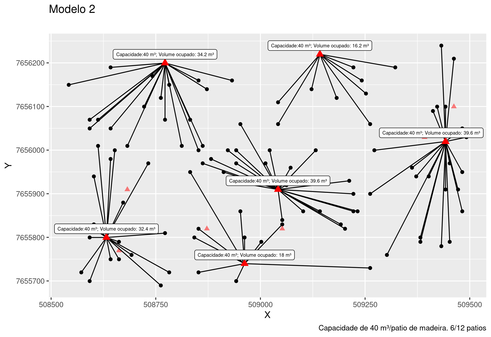

  
  
  A extração por arraste é uma etapa da colheita florestal onde as toras são transportadas da área de corte até a margem do talhão, estrada ou pátio intermediário.
  
  A distância de extração tem impacto direto nos custos da operação de colheita florestal. Quanto maior a distância entre a área de corte e o pátio de estocagem, maior é o tempo gasto e o consumo de combustível dos equipamentos de arraste, o que eleva os custos operacionais. Além disso, distâncias maiores aumentam o desgaste das máquinas e a necessidade de manutenção, além de prolongarem o ciclo de trabalho, reduzindo a produtividade da equipe.
  
  Otimizar a localização das pilhas de estocagem para minimizar essas distâncias é essencial para uma operação mais econômica e eficiente.
  
 O método da p-mediana é amplamente utilizado em problemas de localização, como a seleção de pátios de estocagem na colheita florestal, em que é necessário escolher p locais que minimizem a distância total (ou custo) entre os pontos de demanda (como áreas de corte) e os pontos de suprimento (como pátios).
 
O post a seguir é um caderno cujo o intuito foi de desenvolver e explorar novas habilidades  envolvendo a utilização de ferramentas de Geoprocessamento e de Programação Linear Inteira aplicado ao problema de otimização da localização de pilhas na colheita florestal. O custo foi calculado a partir da distância euclidiana, com o trânsito das máquinas sobre os tocos na linha de plantio não sendo incluído como restrição. 
 
Esse esforço me permitiu exercitar o aprendizado em modelagem, onde descobri ferramentas de modelagem e solvers de código aberto e livres, que permitem resolver problemas de PL sem nenhum custo. As bibliotecas ROI e OMPR possibilitam padronizar o código dos modelos já que são compatíveis com diferentes solvers, incluindo softwares proprietários. Isso foi ótimo pois não precisei reescrever o modelo para um novo código à depender do solver que estava utilizando. Apliquei o mesmo modelo nos solvers symphony e glpk e tudo funcionou bem.   
  
  
## 1)  Problema proposto
  
  A área a ser trabalhada pela equipe de planejamento florestal encontra-se localizada no projeto Ferradura, sendo selecionado apenas talhões com idade superior a 3 anos. O mapa a seguir é uma representação da área em análise, que compreende um total de 90 talhões e 4.561 ha com plantio de
Eucaliptus spp.


O objetivo é definir a localização e a quantidade de pátios de estocagem
necessários para a colheita de um talhão do projeto, tendo em
vista o menor custo da operação de extração por arraste.


###  Restrições 

a) Capacidade de armazenamento de madeira por pilha: 200 m³;

b) Distância mínima entre pilhas: 25 m; 

c) considere que não há restrições à instalação das pilhas de estocagem de
madeira nas bordas do talhão avaliado, e 

d) o número de pilhas de estocagem será definido pela razão entre o volume
total de madeira do talhão e a capacidade de armazenamento de madeira na
pilha, cujo resultado será acrescido de mais uma pilha. 


## 2)  Preparando os dados 


```r
library(sf)
library(rgdal)
library(spatialEco)
# library(rgeos)
library(tidyr)
library(dplyr)
library(raster)
library(terra)
library(igraph)
library(ggplot2)
```


Área do projeto.


```r
prj <-
  st_read("/home/vinicio/Documentos/PCF-508/PESQUISA OPERACIONAL PCF-508 VINICIO LIMA/P_Mediana/Dados/Projeto.ferradura.shp")
prj$Sitio <- paste0('S', prj$Sitio)
prj <- prj %>% filter(idade > 3)
```


Idade e sítio.


```r
tabela_1 = data.frame(
  Idade = c(4, 5, 6, 7, 8, 9, 10),
  S1 = c(250, 300, 348, 394, 439, 483, 526),
  S2 = c(200, 240, 278, 316, 352, 387, 421),
  S3 = c(180, 216, 251, 284, 316, 348, 379)
)

tabela_1 = tabela_1 %>% pivot_longer(
  cols = c('S1', 'S2', 'S3'),
  names_to = 'Sitio',
  values_to = "Volume"
)
```


Quantidade de pilhas por talhão.


```r
prj_c <- left_join(prj, tabela_1, by = c("Sitio" = "Sitio", "idade" = "Idade")) %>%
  mutate(n_pilhas = round((Volume * area / 200) + 1))

prj_c[1:4,] # prj_c = projeto colheita 
```

```
## Simple feature collection with 4 features and 7 fields
## Geometry type: POLYGON
## Dimension:     XY
## Bounding box:  xmin: 503495 ymin: 7651331 xmax: 509493.7 ymax: 7653584
## Projected CRS: SAD69 / UTM zone 23S
##   Id area idade Talhao Sitio Volume                       geometry n_pilhas
## 1  0   19     5      5    S3    216 POLYGON ((503841.5 7652307,...       22
## 2  0   39     6      7    S3    251 POLYGON ((503929.5 7652152,...       50
## 3  0   36     6     10    S3    251 POLYGON ((508861 7652259, 5...       46
## 4  0   27     7     11    S1    394 POLYGON ((503919.5 7653290,...       54
```


Selecionar um talhão.


```r
# prj_t = prj_c %>% sample_n(1)
prj_t = prj_c %>% filter(Talhao == 67) # prj_t = talhao  selecionado
prj_t %>% st_drop_geometry()
```

```
##   Id area idade Talhao Sitio Volume n_pilhas
## 1  0   50     4     67    S3    180       46
```


#### Definindo a área que uma pilha vai ocupar no talhão  (25m x 25m).

Alocando as pilhas de madeira na borda do talhão.


```r
r <- rast(ext(prj_t), res = 10) 
rast <- rasterize(vect(prj_t), r, values=1, background=0)
r2 = raster(rast)
crs(r2) <- "+proj=utm +zone=23 +south +ellps=aust_SA +units=m +no_defs" 

perimetro <- prj_t %>% st_cast(to = "LINESTRING")
r3 <- rast(ext(prj_t),
           nrow = 23,
           ncol = 39,
           res = 25)


per <- raster(rasterize(
  vect(perimetro),
  r3,
  values = 1,
  background = 0,
  touches = TRUE
))


tbl_per = rasterToPolygons(
  per,
  fun = NULL,
  n = 4,
  na.rm = TRUE,
  digits = 12,
  dissolve = FALSE
) %>% st_as_sf()

# filtra somente bordadura
tbl_1 = tbl_per %>% filter(layer == 1) 
st_crs(tbl_1) <- "+proj=utm +zone=23 +south +ellps=aust_SA +units=m +no_defs" 
```


Garantindo a distância de 25m entre pilhas. 


```r
my_graph <- graph_from_adj_list(st_touches(tbl_1)) # input perimetro grid 25x25

id_to_be_ignored <- ego(my_graph, order = 1, nodes = 1)[[1]]
all_second_order_neighbours <- ego(my_graph, order = 2, nodes = 1)[[1]]
final_sample <- difference(all_second_order_neighbours, id_to_be_ignored)

i <- 1
while (TRUE) {
  if (i > length(final_sample)) break
  id <- final_sample[[i]]
  ego1_id <- ego(my_graph, order = 1, nodes = id)[[1]]
  id_to_be_ignored <- union(id_to_be_ignored, difference(ego1_id, V(my_graph)[id]))
  ego2_id <- difference(ego(my_graph, order = 2, nodes = id)[[1]],  ego1_id )
  
  final_sample <- difference(union(final_sample, ego2_id), id_to_be_ignored)
  i <- i + 1
}

pilhas = tbl_1[c(1, as.integer(final_sample)), ]
```


Parcelas do talhão  (Grid 10m x 10m).


```r
r.grid <- rast(ext(prj_t), res = 10) 
tal <- raster(rasterize(vect(prj_t), r.grid, values=1, background=0, touches = FALSE))
tal_mask = mask(tal, prj_t)
tal_mask[!is.na(tal_mask)][] <- 0

x = rasterToPolygons(
  tal_mask, fun = NULL, n = 4,  na.rm = TRUE,  digits = 12,  dissolve = FALSE
)  %>% st_as_sf()
st_crs(x) <- "+proj=utm +zone=23 +south +ellps=aust_SA +units=m +no_defs"
```


Distribuição das pilhas no talhão selecionado.


```r
pilhas_point = st_centroid(pilhas)
x_point = st_centroid(x)

plot(st_geometry(st_centroid(x_point)),
     pch = 3,  col = 'black', cex = 2. ,  axes = TRUE,
     main = "Distribuição das pilhas no talhão (T67)", 
     sub = ""
)

plot(st_geometry(pilhas_point),pch = 24,  cex = 1.5,  col = "blue",
     bg = "red",  lwd = 1 ,
     add = TRUE
)
```

}}index_files/figure-html/distribui_pilhas-1.png" width="90%" />


## 3) Reduzindo o problema 

Exemplo simplificado para abstração do problema a partir de um subset dos dados originais. O objetivo é testar e validar a funcionalidade do modelo em uma escala menor.


### Amostragem aleatória

Problema reduzido contendo 100 parcelas e 12 pátios de estocagem. 


```r
rownames(x_point) <- as.integer(row.names(x_point))
x_point$point_name <- as.integer(row.names(x_point))
```


```r
grids =  subsample.distance(
as(x_point, "Spatial"), # SpatialEco agora recebe objeto sf
  x_point,
  size = 100, d = 10) # %>% st_as_sf() # 100 parcelas 

pil  = subsample.distance(
as(st_crop(  x_point, st_bbox(grids)), "Spatial"), # SpatialEco agora recebe objeto sf
st_crop(  x_point, st_bbox(grids)),
size = 12, d = 25) # %>%  st_as_sf() # 12 pátios
```


```r
plot(st_geometry(st_centroid(grids)), pch = 3, col = 'black', cex= 2. , axes = TRUE, 
     main = "Exemplo hipotético para modelagem do problema")
plot(st_geometry(pil), pch = 24, cex=3, col="blue", bg="red", lwd=2,   add = TRUE )
```

}}index_files/figure-html/plot_reduz_problema-1.png" width="80%" />


## 4) Matriz de custo

Distância euclidiana entre as parcelas (grids) e os pátios. 


```r
# Obsoleto - rgeos
# cost =  rgeos::gDistance(as(pil, "Spatial"),
#                          as(grids, "Spatial") , byid = TRUE) 

cost = st_distance(pil, grids)
cost[1:3,1:1 ] %>% t() # Exemplo da saída da matriz de custo 
```

```
## Units: [m]
##          [,1]    [,2]     [,3]
## [1,] 290.6888 661.211 143.1782
```


### Tabelas para plotagem


```r
grids$id <- 1:nrow(grids)
grids$id_grid <- grids$id
grids$grids_name <- rownames(grids)
XY.grids <-  st_coordinates(grids)
grids <- grids %>% mutate(X_g = XY.grids[, 1],
                          Y_g = XY.grids[,2] )
grids <- cbind(grids, XY.grids) %>% st_drop_geometry()

pil$id <- 1:nrow(pil)
pil$id_pil <- pil$id
pil$pil_name <- rownames(pil)
XY.pil <-  st_coordinates(pil)
pil <- pil %>% mutate(X_p = XY.pil[, 1],
                      Y_p = XY.pil[,2] )
pil <- cbind(pil, XY.pil) %>% st_drop_geometry()
```


## 5) Ferramentas de modelagem e Solvers

### OMPR

OMPR (Optimization Modeling Package) é uma DSL para modelar e resolver
programas lineares inteiros mistos. É inspirado no projeto Jump em
Julia. (Fonte:  https://dirkschumacher.github.io/ompr/)


```r
library(ompr)
```


### ROI

O pacote R Optimization Infrastructure ([ROI](https://roi.r-forge.r-project.org/index.html))
fornece uma infraestrutura extensível para modelar problemas de otimização
linear, quadrática, cônica e geral de maneira consistente. (Fonte: https://roi.r-forge.r-project.org/index.html)


```r
library(ROI)
library(ompr.roi)
```


O ROI fornece os recursos de modelagem e gerencia os plug-ins. Os plug-ins
adicionam os solucionadores ao ROI. Entre os solvers disponíveis estão 
**Gurobi**, **LPSolve**, **Symphony** e **glpk**.

 

```r
plugins <- ROI_available_solvers()[,c("Package", "Repository")]
plugins <- aggregate(Repository ~ Package,  data = plugins, 
                     FUN = paste, collapse = ", ")
knitr::kable(plugins, row.names = TRUE)
```


|   |Package             |Repository                                                   |
|:--|:-------------------|:------------------------------------------------------------|
|1  |ROI.plugin.alabama  |https://CRAN.R-project.org, https://gitlab.com/roigrp/solver |
|2  |ROI.plugin.cbc      |https://github.com/dirkschumacher                            |
|3  |ROI.plugin.cccp     |https://gitlab.com/roigrp/solver                             |
|4  |ROI.plugin.clp      |https://github.com/datastorm-open                            |
|5  |ROI.plugin.cplex    |https://CRAN.R-project.org                                   |
|6  |ROI.plugin.deoptim  |https://CRAN.R-project.org, https://gitlab.com/roigrp/solver |
|7  |ROI.plugin.ecos     |https://CRAN.R-project.org, https://gitlab.com/roigrp/solver |
|8  |ROI.plugin.glpk     |https://CRAN.R-project.org                                   |
|9  |ROI.plugin.gurobi   |https://gitlab.com/roigrp/solver                             |
|10 |ROI.plugin.highs    |https://CRAN.R-project.org, https://gitlab.com/roigrp/solver |
|11 |ROI.plugin.ipop     |https://CRAN.R-project.org                                   |
|12 |ROI.plugin.lpsolve  |https://CRAN.R-project.org                                   |
|13 |ROI.plugin.mosek    |https://gitlab.com/roigrp/solver                             |
|14 |ROI.plugin.msbinlp  |https://CRAN.R-project.org, https://gitlab.com/roigrp/solver |
|15 |ROI.plugin.neos     |https://CRAN.R-project.org, https://gitlab.com/roigrp/solver |
|16 |ROI.plugin.nloptr   |https://CRAN.R-project.org, https://gitlab.com/roigrp/solver |
|17 |ROI.plugin.optimx   |https://CRAN.R-project.org, https://gitlab.com/roigrp/solver |
|18 |ROI.plugin.osqp     |https://CRAN.R-project.org, https://gitlab.com/roigrp/solver |
|19 |ROI.plugin.qpoases  |https://CRAN.R-project.org, https://gitlab.com/roigrp/solver |
|20 |ROI.plugin.quadprog |https://CRAN.R-project.org, https://gitlab.com/roigrp/solver |
|21 |ROI.plugin.scs      |https://CRAN.R-project.org, https://gitlab.com/roigrp/solver |
|22 |ROI.plugin.symphony |https://CRAN.R-project.org, https://gitlab.com/roigrp/solver |


### Symphony 

O SYMPHONY é um solver MILP genérico de código aberto, de estrutura
extensível para implementação de solucionadores personalizados para programação
linear inteira mista (MILPs). (Fonte: https://github.com/coin-or/SYMPHONY)


```r
library(ROI.plugin.symphony)
```


### Modelo 1 - Custo fixo 

Atribiu uma parcela para cada pátio. Não leva em consideração a diferença de custo para ativar os pátios. 


```r
num_depots = nrow(pil)
num_cust = nrow(grids)
custo.fixo = 10  # arbitrário pra todos os pátios # Custo para ativar um pátio # 
volume.t = prj_t$area * prj_t$Volume 
demanda <- volume.t/((prj_t$area)/(res(r.grid)[1]^2/10000))
capacidade <- 40 # arbitrário # Capacidade do pátio de estocagem

cost <- matrix(cost, num_depots, num_cust )
demand = rep(demanda, nrow(grids))
fixedcost =  rep(custo.fixo, nrow(pil))
capacity = rep(capacidade, nrow(pil))
```


```r
m <- MIPModel() %>%
  add_variable(ship[i, j],
               i = 1:num_depots,
               j = 1:num_cust,
               type = "binary") %>%
  add_constraint(sum_expr(demand[j] * ship[i, j], j = 1:num_cust) <= capacity[i],
                 i = 1:num_depots) %>%
  add_constraint(sum_expr(ship[i, j], i = 1:num_depots) == 1, j = 1:num_cust) %>%
  set_objective(sum_expr(cost[i, j] * ship[i, j], i = 1:num_depots, j =
                           1:num_cust), "min") %>%
  solve_model(with_ROI(solver = "symphony", verbosity = 1))

cat("Status:",solver_status(m),"\n")
cat("Objective:",objective_value(m),"\n")
matchs <- get_solution(m,ship[i, j]) %>%
  filter(value > 0) %>% as.data.frame()
```


```r
p <- ggplot(grids, aes( X , Y)) + 
  geom_point() + 
  geom_point(data = pil, color = "red", alpha = 0.5, shape = 17, size= 2) 

plot_assignment = matchs %>% 
  inner_join(grids, by = c("j" = "id")) %>% 
  inner_join(pil, by = c("i" = "id"))

grids_count <- plot_assignment %>% group_by(pil_name) %>% summarise(n = n()) 

grids_count # Total de atribuições
```


```r
plot_pilhas<- pil %>% 
  mutate(costs = capacity) %>% 
  inner_join(grids_count, by = "pil_name") %>% 
  filter(id %in% unique(matchs$i)) %>% mutate(total = n*demanda)

P_mod1 <- p +
  geom_segment(data = plot_assignment,
               aes(
                 x = X.y,
                 y = Y.y,
                 xend = X.x,
                 yend = Y.x
               ),
               lwd = .2) +
  
  geom_point(
    data  = plot_pilhas,
    color = "red",
    size = 2,
    shape = 17
  ) +
  
  ggrepel::geom_label_repel(
    data  = plot_pilhas,
    aes(
      label = paste0("Capacidade:", costs, " m³", "; Volume ocupado: ", total, " m³")
    ),
    size = 1.5,
    nudge_y = 20
  ) +
  
  labs(title = "Modelo 1",
       subtitle =  "Não considera nenhuma restrição de custo para ativação de um determinado pátio.
       \n Todos os pátios serão acionados.")


ggplot2::ggsave("./plot/P_mod_1.png", P_mod1, width = 8, height = 5.5, device = "png")
```


### Modelo 2 - Custo variável

Insere a restrição de custo para ativação de um determinado pátio/pilha.

Na prática força o modelo a ativar os pátios de menor custo e que correspondem 
ao menor custo total.


```r
# Custo para ativação dos pátios. 
v_cost = c(10, 800, 50000, 1000, 300, 3000, 500, 2000, 600, 10, 400, 10) # Variável 


m2 <- MIPModel() %>%
  add_variable(ship[i, j],
               i = 1:num_depots,
               j = 1:num_cust,
               type = "binary") %>%
  add_variable(y[i],  i = 1:num_depots, type = "binary") %>%
  add_constraint(sum_expr(demand[j] * ship[i, j],  j = 1:num_cust) <= capacity[i],
                 i = 1:num_depots) %>%
  add_constraint(sum_expr(ship[i, j], i = 1:num_depots) == 1, j = 1:num_cust) %>%
  set_objective(
    sum_expr(cost[i, j] * ship[i, j], i = 1:num_depots, j = 1:num_cust) +
      sum_over(v_cost[i] * y[i], i = 1:num_depots),
    "min"
  ) %>%
  add_constraint(ship[i, j] <= y[i], i = 1:num_depots, j = 1:num_cust) %>%
  solve_model(with_ROI(solver = "symphony", verbosity = 1))


cat("Status:", solver_status(m2), "\n")
# Status: success 
cat("Objective:", objective_value(m2), "\n")
# Objective: 14454 
matchs <- get_solution(m2, ship[i, j]) %>%
  filter(value > 0) %>% as.data.frame()
```


```r
plot_assignment = matchs %>%
  inner_join(grids, by = c("j" = "id")) %>%
  inner_join(pil, by = c("i" = "id"))

grids_count <-
  plot_assignment %>% group_by(pil_name) %>% summarise(n = n()) 
```


#### Total de atribuições Modelo 2


```r
grids_count

A tibble: 6 × 2
pil_name       n
  <chr>       <int>
 1 1557        18
 2 2837        14
 3 3450        22
 4 4459        12
 5 542         17
 6 755         17
```


```r
plot_pilhas <- pil %>%
  mutate(costs = capacity) %>%
  inner_join(grids_count, by = "pil_name") %>%
  filter(id %in% unique(matchs$i)) %>% mutate(total = n * demanda)

p2a = p +
  geom_segment(data = plot_assignment, aes(
    x = X.y,
    y = Y.y,
    xend = X.x,
    yend = Y.x
  )) +
  geom_point(
    data  = plot_pilhas,
    color = "red",
    size = 3,
    shape = 17
  ) +
  ggrepel::geom_label_repel(
    data  = plot_pilhas,
    aes(
      label = paste0("Capacidade:", costs, " m³", "; Volume ocupado: ", total, " m³")
    ),
    size = 2,
    nudge_y = 20
  ) + 
  
  labs(title = "Modelo 2", 
       subtitle =  "")

#p2a

ggplot2::ggsave(
  filename = "./plot/plot_Mod_2.png",
  plot = p2a,
  width = 8,
  height = 5.5,
  device = "png"
)
```

Em vermelho claro os pátios que não foram acionados em função do maior custo para ativação. Na prática esse modelo pode representar situações onde a região disponível para alocação de um pátio ou pilha de madeira pretende ser evitada. Por exemplo, maior custo para adequação de estradas, locais de maior risco para operação ou evitar o impacto em locais próximos a ambientes sensíveis (áreas de preservação).




### Modelo 2.1

Altera a capacidade para 80 m³ por pátio de madeira afim de comparar a sensibilidade do modelo para definir a ativação dos pátios em função da capacidade e custo.


```r
capacidade <- 80 # Capacidade do pátio de estocagem
capacity = rep(capacidade, nrow(pil))
cost <- matrix(cost/1000, num_depots, num_cust ) # custo em km
```


```r
m2b <- MIPModel() %>%
  add_variable(ship[i, j],
               i = 1:num_depots,
               j = 1:num_cust,
               type = "binary") %>%
  add_variable(y[i],  i = 1:num_depots, type = "binary") %>%
  add_constraint(sum_expr(demand[j] * ship[i, j],  j = 1:num_cust) <= capacity[i],
                 i = 1:num_depots) %>%
  add_constraint(sum_expr(ship[i, j], i = 1:num_depots) == 1, j = 1:num_cust) %>%
  set_objective(
    sum_expr(cost[i, j] * ship[i, j], i = 1:num_depots, j = 1:num_cust) +
      sum_over(v_cost[i] * y[i], i = 1:num_depots),
    "min"
  ) %>%
  add_constraint(ship[i, j] <= y[i], i = 1:num_depots, j = 1:num_cust) %>%
  solve_model(with_ROI(solver = "symphony", verbosity = 1))


cat("Status:",solver_status(m2b),"\n")
# Status: success 

cat("Objective:",objective_value(m2b),"\n")
# Objective: 54.003  

matchs <- get_solution(m2b,ship[i, j]) %>%
  filter(value > 0) %>% as.data.frame()
```


```r
plot_assignment = matchs %>% 
  inner_join(grids, by = c("j" = "id")) %>% 
  inner_join(pil, by = c("i" = "id"))


grids_count <- plot_assignment %>% group_by(pil_name) %>% summarise(n = n()) 
```


#### Total de atribuições do modelo (2.1) 


```r
grids_count

 A tibble: 3 × 2
 pil_name      n
 <chr>       <int>
  1           33
  10          31
  12          36
```


```r
plot_pilhas<- pil %>% 
  mutate(costs = capacity) %>% 
  inner_join(grids_count, by = "pil_name") %>% 
  filter(id %in% unique(matchs$i)) %>% mutate(total = n*demanda)


p2b = p +
  geom_segment(data = plot_assignment, aes(
    x = X.y,
    y = Y.y,
    xend = X.x,
    yend = Y.x
  )) +
  geom_point(
    data  = plot_pilhas,
    color = "red",
    size = 3,
    shape = 17
  ) +
  ggrepel::geom_label_repel(
    data  = plot_pilhas,
    aes(
      label = paste0("Capacidade:", costs, " m³", "; Volume ocupado: ", total, " m³")
    ),
    size = 2,
    nudge_y = 20
  ) +
    labs(title = "Modelo 2.1", 
       subtitle =  "", 
       caption = "Capacidade de 80 m³/pilha. 3/12 pilhas")


ggplot2::ggsave(
  filename = "./plot/plot_Mod_2B.png",
  plot = p2b,
  width = 8,
  height = 5.5,
  device = "png"
)
```


```r
library(cowplot)
png_plot_p2a <- cowplot::ggdraw() + cowplot::draw_image("./plot/plot_Mod_2A.png", scale = 0.9)
png_plot_p2b <- cowplot::ggdraw() + cowplot::draw_image("./plot/plot_Mod_2B.png", scale = 0.9)
grid_MOD_2AB <- cowplot::plot_grid(png_plot_p2a ,png_plot_p2b , labels = "", nrow=2)

ggsave(filename = "./plot/plot_Mod_2AB.png",
       plot = grid_MOD_2AB,  width = 7.5,  height = 10, device = "png")
```


### Modelo 3 P-Mediana

Adiciona a restrição de quantidade de pátios que serão ativados, valor de P. Testando o modelo para 5 pátios. 


```r
capacidade <- 50 # Capacidade das pilhas de estocagem em m³
capacity = rep(capacidade, nrow(pil))
cost <- matrix(cost, num_depots, num_cust) # matriz de custo - dist. 
```


```r
m3 <- MIPModel() %>%
  add_variable(ship[i, j],
               i = 1:num_depots,
               j = 1:num_cust,
               type = "binary") %>%
  add_variable(y[i],  i = 1:num_depots, type = "binary") %>%
  add_constraint(sum_expr(demand[j] * ship[i, j],  j = 1:num_cust) <= capacity[i],
                 i = 1:num_depots) %>%
  add_constraint(sum_expr(ship[i, j], i = 1:num_depots) == 1, j = 1:num_cust) %>%
  set_objective(
    sum_expr(cost[i, j] * ship[i, j], i = 1:num_depots, j = 1:num_cust) +
      sum_over(v_cost[i] * y[i], i = 1:num_depots),
    "min"
  ) %>%
  add_constraint(ship[i, j] <= y[i], i = 1:num_depots, j = 1:num_cust) %>%
  add_constraint(sum_expr(y[i],   i = 1:num_depots) <= 5) %>%  # Valor de P
  solve_model(with_ROI(solver = "symphony", verbosity = 1))

cat("Status:",solver_status(m3),"\n")
cat("Objective:", objective_value(m3),"\n")

matchs_m3 <- get_solution(m3,ship[i, j]) %>%
  filter(value > 0) %>% as.data.frame()
```


```r
plot_assignment_m3 = matchs_m3 %>% 
  inner_join(grids, by = c("j" = "id")) %>% 
  inner_join(pil, by = c("i" = "id"))

grids_count_m3 <- plot_assignment_m3 %>% group_by(pil_name) %>% summarise(n = n()) 
```

#### Total de atribuições Modelo 3


```r
grids_count_m3 

 A tibble: 5 × 2
  pil_name     n
  <chr>    <int>
   10       16
   2        17
   4        27
   7        26
   8        14
```


```r
plot_pilhas_m3 <- pil %>% 
  mutate(costs = capacity) %>% 
  inner_join(grids_count_m3, by = "pil_name") %>% 
  filter(id %in% unique(matchs_m3$i)) %>% mutate(total = n*demanda)

p_m3 <- p +
  geom_segment(data = plot_assignment_m3, aes(
    x = X.y,
    y = Y.y,
    xend = X.x,
    yend = Y.x
  )) +
  geom_point(
    data  = plot_pilhas_m3,
    color = "red",
    size = 3,
    shape = 17
  ) +
  ggrepel::geom_label_repel(
    data  = plot_pilhas_m3,
    aes(
      label = paste0("Capacidade:", costs, " m³", "; Volume ocupado: ", total, " m³")
    ),
    size = 2,
    nudge_y = 20
  ) + 
  
  labs(title = "Modelo 3 ", 
       subtitle =  "P = 5")

ggsave(filename = "./plot/plot_Mod_3.png",
       plot = p_m3,
       width = 7.5,
       height = 10,
       device = "png"
)
```


## 6) Retorna ao problema original 

Após validar o comportamento dos modelos podemos aplicar o modelo da p-mediana para
minimizar o custo da extração por arraste no talhão 67 do projeto Ferradura.

O talhão foi dividido em parcelas (grids) de 10m x 10m e um total de 55 pilhas 
distribuídas nas bordas do talhão, com a distância mínima de 25m entre as pilhas (item 2 - Preparando os dados). 

A quantidade de pilhas estipulada pela área de planejamento foi de 46 + 1 pilha. 


```r
grids =  x_point 
pil  = pilhas_point

# rgeos - obsoleto
# cost =  rgeos::gDistance(as(pil, "Spatial"), as(grids, "Spatial") , byid = TRUE)
# cost <- cost %>% t() %>% as.vector() %>% round()

cost = st_distance(pil, grids)
cost <- cost %>% as.vector() %>% round()

num_depots = nrow(pil)
num_cust = nrow(grids)
custo.fixo = 10 # Custo para ativar um pátio
volume.t = prj_t$area * prj_t$Volume 
demanda <- volume.t/((prj_t$area)/(res(r.grid)[1]^2/10000))# Demanda em m³ de uma parcela
capacidade <- 200 # Capacidade dos pátios de estocagem original do problema 

cost <- matrix(cost, num_depots, num_cust )
demand = rep(demanda, nrow(grids))
fixedcost =  rep(custo.fixo, nrow(pil))
capacity = rep(capacidade, nrow(pil))
p = prj_t$n_pilhas + 1 # restrição (d) do problema
```


### Modelo 


```r
# Função

pmediana <- function(){
solucao <- MIPModel() %>%
  add_variable(ship[i, j],
               i = 1:num_depots,
               j = 1:num_cust,
               type = "binary") %>% 
  add_variable(y[i],  i = 1:num_depots, type = "binary") %>%
  add_constraint(sum_expr(demand[j] * ship[i, j],  j = 1:num_cust) <= capacity[i],
                 i = 1:num_depots) %>%
  add_constraint(sum_expr(ship[i, j], i = 1:num_depots) == 1, j = 1:num_cust) %>%
  set_objective(
    sum_expr(cost[i, j] * ship[i, j], i = 1:num_depots, j = 1:num_cust) +
      sum_over(fixedcost[i] * y[i], i = 1:num_depots),
    "min"
  ) %>%
  add_constraint(ship[i, j] <= y[i], i = 1:num_depots, j = 1:num_cust) %>%
  add_constraint(sum_expr(y[i],   i = 1:num_depots) <= p) %>%
  solve_model(with_ROI(
    solver = "symphony",
    verbosity = 1,
    first_feasible = TRUE
  ))

return(solucao)

}
```


```r
# Aplica

start.time <- Sys.time()
m_pvalue <- pmediana()
end.time <- Sys.time()
time.taken <- end.time - start.time
time.taken
```


Infelizmente o tempo de processamento foi muito longo..... :/


A saída encontrada foi reduzir a quantidade de parcelas e o número de pilhas para obter uma solução em 
um tempo menor. 


```r
# Grids

r.grid <- rast(ext(prj_t), res = 50) 
tal <- raster(rasterize(vect(prj_t), r.grid, values=1, background=0, touches = FALSE))
tal_mask = mask(tal, prj_t)
tal_mask[!is.na(tal_mask)][] <- 0

x = rasterToPolygons(
  tal_mask,
  fun = NULL,
  n = 4,
  na.rm = TRUE,
  digits = 12,
  dissolve = FALSE
)  %>% st_as_sf()

st_crs(x) <- "+proj=utm +zone=23 +south +ellps=aust_SA +units=m +no_defs"
x_point = st_centroid(x)

grids <- x_point

# Pilhas 

pil  = pilhas_point
pil  = subsample.distance(
  # as(pil, "Spatial"), # SpatialEco agora recebe objeto sf
  pil,
  size = 23, d = 100) %>%  st_as_sf() # 23 pilhas


# Plot

plot(st_geometry(st_centroid(grids)), pch = 3, col = 'black', cex= 2, axes = TRUE,
     main = "196 Parcelas e 23 pilhas")
plot(st_geometry(pil), pch = 24, cex=3, col="blue", bg="red", lwd=2, add = TRUE )
```


Dado o novo cenário considerei a capacidade de 750 m³ por pilha e que a decisão tomada
pela equipe de planejamento florestal foi de ativar 15 das 23 pilhas possíveis (valor de P = 15). 


```r
# Matiz de Custo

# rggeos - Obsoleto
# cost =  rgeos::gDistance(as(pil, "Spatial"), as(grids, "Spatial") , byid = TRUE) 
# cost <- cost %>% t() %>% as.vector() %>% round()

cost = st_distance(pil, grids)
cost <- cost %>% as.vector() %>% round()

# Restrições

num_depots = nrow(pil)
num_cust = nrow(grids)
custo.fixo = 10 # Custo para ativar um pátio
volume.t = prj_t$area * prj_t$Volume 
demanda <- volume.t/((prj_t$area)/(res(r.grid)[1]^2/10000)) # Demanda em m³ de uma parcela
capacidade <- 750 #  considera um total de 15 pilhas

cost <- matrix(cost, num_depots, num_cust )
demand = rep(demanda, nrow(grids))
fixedcost =  rep(custo.fixo, nrow(pil))
capacity = rep(capacidade, nrow(pil))
#p = prj_t$n_pilhas
p = 15 # Valor P

# Solução
start.time <- Sys.time()
m_pvalue <- pmediana()
end.time <- Sys.time()
time.taken <- end.time - start.time

# cat("Status:",solver_status(m_pvalue),"\n")
# cat("Objective:",objective_value(m_pvalue),"\n")
```


### Cria o mapa para a solução


```r
matchs <- get_solution(m_pvalue,ship[i, j]) %>%
  filter(value > 0) %>% as.data.frame()


grids$id <- 1:nrow(grids)
grids$id_grid <- grids$id
grids$grids_name <- rownames(grids)
XY.grids <-  st_coordinates(grids)
grids <- grids %>% mutate(X_g = XY.grids[, 1],
                          Y_g = XY.grids[,2] )
grids <- cbind(grids, XY.grids) %>% st_drop_geometry()

pil$id <- 1:nrow(pil)
pil$id_pil <- pil$id
pil$pil_name <- rownames(pil)
XY.pil<-  st_coordinates(pil)
pil <- pil %>% mutate(X_p = XY.pil[, 1],
                      Y_p = XY.pil[,2] )
pil <- cbind(pil, XY.pil) %>% st_drop_geometry()

plot_assignment = matchs %>% 
  inner_join(grids, by = c("j" = "id")) %>% 
  inner_join(pil, by = c("i" = "id"))

grids_count <- plot_assignment %>% group_by(pil_name) %>% summarise(n = n()) 

grids_count # Total de atribuições 

plot_pilhas <- pil %>% 
  mutate(costs = capacity) %>% 
  inner_join(grids_count, by = "pil_name") %>% 
  filter(id %in% unique(matchs$i)) %>% mutate(total = n*demanda)

plot_pilhas = st_as_sf(x=plot_pilhas,
                  coords = c("X_p", "Y_p"),
                crs= "+proj=utm +zone=23 +south +ellps=aust_SA +units=m +no_defs")

p_point = st_as_sf(x=plot_assignment,
                   coords = c("X_g", "Y_g"),
                   crs= "+proj=utm +zone=23 +south +ellps=aust_SA +units=m +no_defs")

r_tal <- raster::raster(rasterize(vect(st_buffer(p_point, 2)), r.grid, field = "pil_name",
                          fun=max, background=NA, touches = FALSE))
r_tal = mask(r_tal, prj_t)

raster_df <- rasterToPoints(r_tal, spatial = TRUE)

tal_spdf <- as(raster_df, 'SpatialPixelsDataFrame')
tal_df <- as.data.frame(tal_spdf)
colnames(tal_df) <- c("value", "x", "y")
```


### Plot


```r
library(ggthemes)

tal_67 = 
  ggplot() +  
  geom_tile(data=tal_df, aes(x=x, y=y, fill= value), alpha=0.8) + 
  geom_sf() +
  geom_sf(data = plot_pilhas, color = "red", shape = 17, size= 5) + 
  ggrepel::geom_label_repel(data  = plot_pilhas, 
               aes(x=X, y=Y, label= paste0(
               " Volume ocupado: ", total, " m³")),
                            size = 2, nudge_y = 24)+
  coord_sf(xlim = c(st_bbox(plot_pilhas)[1] , st_bbox(plot_pilhas)[3]),
           ylim = c(st_bbox(plot_pilhas)[2], st_bbox(plot_pilhas)[4] ), expand = TRUE) + 
  scale_fill_gradientn(colours = c("white", "black"), values = c(0, 1)) + 
  theme(panel.grid = element_blank())+
  theme_bw()+
  theme(legend.position="none",
        axis.text.y = element_text(angle = 90, vjust = 0.5, hjust=1),
         axis.text = element_text(size = 5.5),          
        ) +
  labs(title = "Mapa de localização das pilhas ", 
       subtitle =  "p-mediana = 15", 
       caption = "Mapa de localização da solução ótima encontrada para minimização do custo de extração por
       arraste usando o modelo da p-mediana. Atribui cada parcela do talhão para a pilha de menor distância
       a ser percorrida pela máquina, considerando p locais disponíveis para a instalação dos pátios.
                   Solver: Symphony") + 
   theme(
    plot.title = element_text(size = 11, face = "bold"),       # Controle do título
    plot.subtitle = element_text(size = 8, face = "italic"), # Controle do subtítulo
    plot.caption = element_text(size = 5.5, face = "plain")    # Controle da fonte
  )


ggsave(
  plot = tal_67,
  filename = "./plot/p_mediana_T67.png",
  width = 20,
  height = 15,
  units = "cm", 
  device = "png"
  )
```


```r
Starting Preprocessing...
Preprocessing finished...
 	 with no modifications...
Problem has 
	 4728 constraints 
	 4531 variables 
	 18055 nonzero coefficients

Total Presolve Time: 0.051709...

Solving...

granularity set at 1.000000
solving root lp relaxation
The LP value is: 23942.000 [0,377]


****** Found Better Feasible Solution !
****** Cost: 23942.000000


****************************************************
* Stopping After Finding First Feasible Solution   *
* Now displaying stats and best solution found...  *
****************************************************

======================= CP Timing ===========================
  Cut Pool                  0.000
====================== LP/CG Timing =========================
  LP Solution Time          0.019
  LP Setup Time             0.001
  Variable Fixing           0.000
  Pricing                   0.000
  Strong Branching          0.000
  Separation                0.000
  Primal Heuristics         0.000
  Communication             0.000
=================== Parallel Overhead ======================
  Communication         0.000
  Ramp Up Time (TM)     0.053
  Ramp Down Time        0.000
  Total User Time              0.019
  Total Wallclock Time         0.074

====================== Statistics =========================
Number of created nodes :       1
Number of analyzed nodes:       1
Depth of tree:                  0
Size of the tree:               1
Number of solutions found:      1
Number of solutions in pool:    1
Number of Chains:               1
Number of Diving Halts:         0
Number of cuts in cut pool:     0
Lower Bound in Root:            23942.000

======================= LP Solver =========================
Number of times LP solver called:                 1
Number of calls from feasibility pump:            0
Number of calls from strong branching:            0
Number of solutions found by LP solve:            1
Number of bounds changed by strong branching:     0
Number of nodes pruned by strong branching:       0
Number of bounds changed by branching presolver:  0
Number of nodes pruned by branching presolver:    0

==================== Primal Heuristics ====================
                             Time      #Called   #Solutions
Rounding I                   0.00                           
Rounding II                  0.00                           
Diving                       0.00 
Feasibility Pump             0.00 
Local Search                 0.01            1            0 
Restricted Search            0.00 
Rins Search                  0.00 
Local Branching              0.00 

=========================== Cuts ==========================
Accepted:                         0
Added to LPs:                     0
Deleted from LPs:                 0
Removed because of bad coeffs:    0
Removed because of duplicacy:     0
Insufficiently violated:          0
In root:                          0

Time in cut generation:              0.00
Time in checking quality and adding: 0.00

                   Time     #Called     In Root       Total
Gomory             0.00 
Knapsack           0.00 
Clique             0.00 
Probing            0.00 
Flowcover          0.00 
Twomir             0.00 
Oddhole            0.00 
Mir                0.00 
Rounding           0.00 
LandP-I            0.00 
LandP-II           0.00 
Redsplit           0.00 

===========================================================
Solution Found: Node 0, Level 0
Solution Cost: 23942.0000000000
```


```r
info = sessionInfo()
info
```

```
## R version 4.4.1 (2024-06-14)
## Platform: x86_64-pc-linux-gnu
## Running under: Ubuntu 20.04.6 LTS
## 
## Matrix products: default
## BLAS:   /usr/lib/x86_64-linux-gnu/blas/libblas.so.3.9.0 
## LAPACK: /usr/lib/x86_64-linux-gnu/lapack/liblapack.so.3.9.0
## 
## locale:
##  [1] LC_CTYPE=pt_BR.UTF-8       LC_NUMERIC=C              
##  [3] LC_TIME=pt_BR.UTF-8        LC_COLLATE=pt_BR.UTF-8    
##  [5] LC_MONETARY=pt_BR.UTF-8    LC_MESSAGES=pt_BR.UTF-8   
##  [7] LC_PAPER=pt_BR.UTF-8       LC_NAME=C                 
##  [9] LC_ADDRESS=C               LC_TELEPHONE=C            
## [11] LC_MEASUREMENT=pt_BR.UTF-8 LC_IDENTIFICATION=C       
## 
## time zone: America/Sao_Paulo
## tzcode source: system (glibc)
## 
## attached base packages:
## [1] stats     graphics  grDevices utils     datasets  methods   base     
## 
## other attached packages:
##  [1] ROI.plugin.symphony_1.0-0 ompr.roi_1.0.2           
##  [3] ROI_1.0-1                 ompr_1.0.4               
##  [5] ggplot2_3.5.1             igraph_2.0.3             
##  [7] terra_1.7-78              raster_3.6-26            
##  [9] dplyr_1.1.4               tidyr_1.3.1              
## [11] spatialEco_2.0-2          rgdal_1.6-7              
## [13] sp_2.1-4                  sf_1.0-16                
## 
## loaded via a namespace (and not attached):
##  [1] gtable_0.3.5       xfun_0.43          bslib_0.7.0        lattice_0.22-5    
##  [5] vctrs_0.6.5        tools_4.4.1        generics_0.1.3     tibble_3.2.1      
##  [9] proxy_0.4-27       fansi_1.0.6        highr_0.10         pkgconfig_2.0.3   
## [13] Matrix_1.6-5       KernSmooth_2.23-24 data.table_1.15.4  checkmate_2.3.2   
## [17] listcomp_0.4.1     lifecycle_1.0.4    compiler_4.4.1     munsell_0.5.1     
## [21] codetools_0.2-19   htmltools_0.5.8.1  class_7.3-22       sass_0.4.9        
## [25] yaml_2.3.8         lazyeval_0.2.2     pillar_1.9.0       jquerylib_0.1.4   
## [29] classInt_0.4-10    cachem_1.0.8       tidyselect_1.2.1   digest_0.6.35     
## [33] slam_0.1-54        purrr_1.0.2        bookdown_0.39      fastmap_1.1.1     
## [37] grid_4.4.1         colorspace_2.1-0   cli_3.6.2          magrittr_2.0.3    
## [41] utf8_1.2.4         e1071_1.7-14       withr_3.0.0        scales_1.3.0      
## [45] backports_1.4.1    Rsymphony_0.1-33   registry_0.5-1     rmarkdown_2.26    
## [49] blogdown_1.19      evaluate_0.23      knitr_1.46         rlang_1.1.3       
## [53] Rcpp_1.0.12        glue_1.7.0         DBI_1.2.2          rstudioapi_0.16.0 
## [57] jsonlite_1.8.8     R6_2.5.1           units_0.8-5
```


```r
rmarkdown::render('pmediana_vinicio.R',
                  output_format = c("html_document", "pdf_document"))
```

