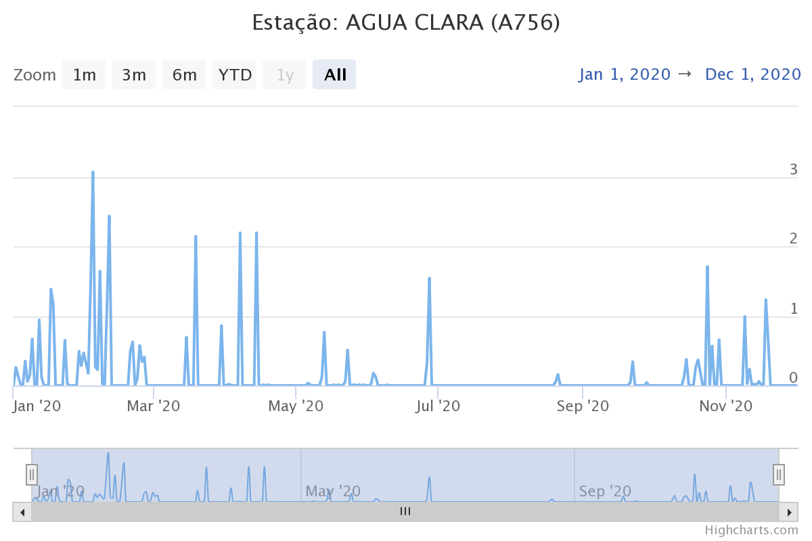
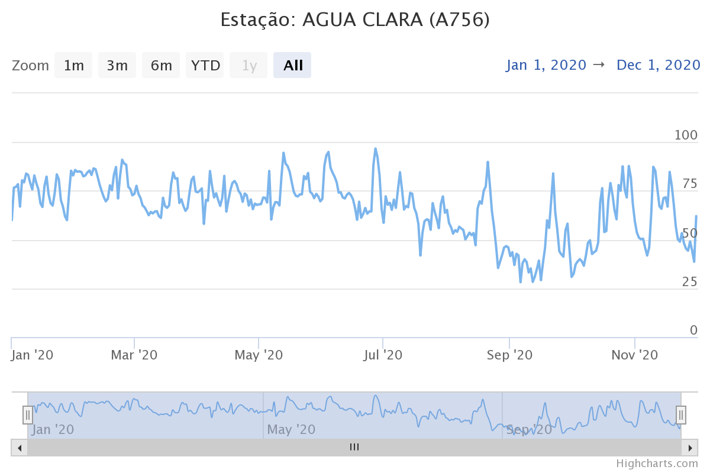
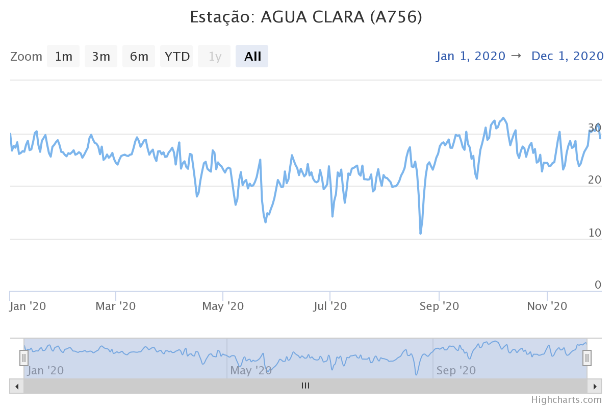

No contexto de sensoriamento remoto e observação da Terra, _spatiotemporal array_ refere-se a matrizes multidimensionais onde duas dimensões representam as dimensões  espaciais do raster e o terceiro o tempo (ou a banda). Essa abordagem permite otimizar o acesso e a recuperação de informações específicas em determinados momentos ou locais para séries espaço-temporais.


```{r fig1, echo=FALSE, out.width="100%", fig.align='center'}
knitr::include_graphics("./images/fig-cube-1.png", error = FALSE)
```


Na estrutura de um cubo de dados raster, entretanto, também são considerados cubos de dimensões superiores (hipercubos), como um cubo de cinco dimensões onde, além do tempo, a banda espectral e o sensor formam dimensões.


```{r fig_gdalcube, include=TRUE, echo=FALSE, out.width = '80%', fig.align='center'}
knitr::include_graphics('./images/cube.png')
```


É uma estrutura eficiente para a manipulação de séries temporais de dados raster, permitindo declarar operações algébricas e aplicar funções a um conjunto limitado de dimensões para realizar cálculos e transformações pixel a pixel e criar novas representações dos dados. 

A seguir iremos explorar a biblioteca gdalcubes para analisar um conjunto de imagens do sensor MSI a bordo dos satélites Sentinel-2A e Sentinel-2B. 


## Conjunto de dados


O conjunto de dados contém 19 cenas de uma área de Cerrado do Estado de Mato Grosso do Sul adquiridas entre fevereiro e julho de 2020.


```{r size.draft, include=TRUE, echo=FALSE, eval=TRUE}


 files.size <- 21.2

```


```{r files, include=TRUE, echo=TRUE, eval=TRUE}

path_file <- "/home/vinicio/Documentos/Codigo/TS_gdalcubes/Sentinel2_15bands/"

s2_files <- list.files( paste(path_file,  "raw", sep="/"),
    pattern = ".zip$", recursive = TRUE )

s2_files

```


```{r files_size, include=TRUE, echo=TRUE, eval=FALSE}


files.size <- sum(file.size(s2_files)) / 1000^3 # gigabytes

files.size # gigabytes

```


```{r files_size_eval, include=TRUE, echo=FALSE, eval=TRUE}


files.size # gigabytes

```


## gdalcubes

[gdalcubes](https://gdalcubes.github.io/) é um pacote R e uma biblioteca C++ para o processamento de grandes coleções de imagens de satélite. 


```{r library, include=TRUE, echo=TRUE }

library(magrittr)
library(gdalcubes)
packageVersion("gdalcubes")

```


```{r img.collection_0, include=TRUE, echo=TRUE, eval=TRUE}

# Cria uma coleção de imagens gdalcubes

if(!file.exists(file.path(path_file, "S2_collection.db" ))){
 S2_download_zip = list.files( paste(path_file, "raw", sep = "/"),
                     pattern = ".zip$",  full.names = TRUE, recursive = TRUE )

 create_image_collection(
   files = S2_download_zip, format='Sentinel2_L2A',
   unroll_archives=TRUE, out_file=file.path(
     path_file,  "S2_collection.db"))
}

```


```{r img.collection.1, include=TRUE, echo=TRUE, eval=TRUE}


S2_collection <- image_collection(file.path(
  path_file, "S2_collection.db"))  

S2_collection

```


Uma view define a geometria espaço-temporal sem conectá-la ao conjuntos de dados específicos. Isso é especialmente útil quando se trabalha com grandes volumes de dados raster. É uma representação específica da série temporal que pode ser definida pela geometria do cubo.

Uma view do cubo de dados contém o sistema de referência espacial (SRS), a extensão espaçotemporal (esquerda, direita, inferior, superior, data/hora de início, data/hora de término) e o tamanho espaçotemporal dos pixels (tamanho espacial, duração temporal).

Por exemplo, podemos criar uma view que aplica uma reamostragem dos pixels para 250 m e uma agragação temporal pela mediana de um intervalo mensal para obter uma visão geral da série. 


```{r create_overview, include=TRUE, echo=TRUE, eval=TRUE, message=FALSE, warning=FALSE}

 # Visão geral da cena
v.overview = cube_view(
  extent=S2_collection, 
  dx=250, dy=250, # 250 m x 250 m
  resampling = "bilinear", # interpolador da reamostragem
  srs="EPSG:31982", # projeção de destino
  dt="P1M", aggregation = "median" # mediana para o mês.
  )

v.overview 

```


A combinação de uma visualização `cube_view()` da geometria do cubo  com a coleção de imagens produz um cubo de dados raster regular contendo os metadados da coleção de imagens e a geometria da view `raster_cube()` .


```{r overview_2, include=TRUE, echo=TRUE, eval=TRUE, message=FALSE, warning=FALSE}

 cube.overview <-  raster_cube(S2_collection, v.overview) 

 cube.overview
 
```


```{r cubeview_plot, include=TRUE, echo=FALSE, eval=TRUE, out.width = '150%', message=FALSE, warning=FALSE}

cube.overview %>%
  select_bands(c("B02", "B03", "B04")) %>% # RGB
  plot(
    zlim = c(0, 1200),
    rgb = 3:1,
    key.pos = 1,
    ncol = 3,
    nrow = 2
  )

```


A região da cena compreende uma área ocupada predominantemente por pastagens extensivas e reflorestamento de eucalipto. Podemos obter o NDVI da série para e definir uma região específica para observar um povoamento de Eucalyptus Urograndis.


```{r euc_rgb, include=TRUE, echo=FALSE, eval=TRUE, out.width = '100%', fig.align='center', fig.pos="H"}

v.euc = cube_view(
  extent=list(S2_collection, left=321434.9, right=326500,
              bottom=7813432, top=7819363,
             t0="2020-02-15", t1="2020-07-31"),
            dt="P1M", dx=50, dy=50, srs="EPSG:31982",
            aggregation = "median", resampling = "bilinear")


# RGB

  raster_cube( S2_collection, v.euc) %>%
  select_bands(c("B02","B03","B04")) %>% # RGB
    reduce_time(c("median(B02)","median(B03)","median(B04)")) %>%
  plot(zlim=c(0,1200), rgb=3:1, key.pos=1, ncol =1, nrow=1 )

```


O produto [L2A](https://docs.sentinel-hub.com/api/latest/data/sentinel-2-l2a/) inclui bandas de máscara e  sinalizadores de qualidade de pixels, entre outras camadas que podem ser usadas para filtrar pixels espúrios ou atender determinada análise.

As máscaras são aplicadas em imagens e não em cubos. Os valores mascarados não contribuirão para a agregação de pixels.


```{r scl_mask, include=TRUE, echo=TRUE, eval=TRUE, message=FALSE, warning=FALSE}

s2.clear.mask <- image_mask("SCL", values= c(0,1,2,3,5,6,7,8,9,10,11 )) # Vegetação

```


```{r euc_ndvi, include=TRUE, echo=TRUE, eval=TRUE, message=FALSE, warning=FALSE, fig.align='center', out.width = '150%'}

v.euc = cube_view(
  extent=list(S2_collection, left=321434.9, right=326500,
              bottom=7813432, top=7819363,
             t0="2020-02-15", t1="2020-07-31"),
            dt="P1M", dx=100, dy=100, srs="EPSG:31982",
            aggregation = "median", resampling = "bilinear")


# NDVI

month_euc_ndvi <- raster_cube( S2_collection, v.euc, mask = s2.clear.mask) %>%
   select_bands(c("B04","B08", "SCL")) %>%
  apply_pixel(c("(B08-B04)/(B08+B04)"), names="NDVI") 

# kNDVI

month_euc_kndvi <- raster_cube( S2_collection, v.euc, mask = s2.clear.mask) %>%
   select_bands(c("B04","B04","B08", "SCL")) %>% 
 apply_pixel("tanh(((B08-B04)/(B08+B04))^2)", "kNDVI") 

library(viridis)
month_euc_ndvi %>%  filter_pixel("NDVI > 0.7") %>% # filtra outros usos
  plot(zlim=c(0.55, .9), key.pos=1,  ncol =3, nrow=2, col=viridis)


```


```{r reduce_space_ndvi, include=TRUE, echo=TRUE, eval=TRUE, message=FALSE, warning=FALSE, fig.align='center', out.width = '95%'}

month_euc_ndvi %>% filter_pixel("NDVI > 0.7") %>% 
  reduce_space(#"sum(NDVI)",
               "mean(NDVI)",
               "min(NDVI)",
               "max(NDVI)",
               "median(NDVI)",
               "sd(NDVI))", 
                "count(NDVI)", 
               "var(NDVI)") %>%
  plot(ncol =4, nrow=2)

```


Os dados do NDVI seguem a tendência esperada para o período seco caracteristico da região para o intervalo analisado. É de se esperar que quanto mais próximo do auge do período seco os fatores climáticos afetem o metabolismo das plantas, resultando em valores menores para o NDVI.


Os [dados do INMET](https://tempo.inmet.gov.br/GraficosAnuais) apontam para uma condição típica do clima da região, coincindindo com os mínimos de umidade do ar e longos períodos de estiagem.nmnm


```{r fig_precp_AC, include=TRUE, echo=FALSE, out.width = '60%', fig.align='center', fig.cap= 'Precipitação (mm) para estação Água Clara (A758).' }

```


```{r fig_umid_AC, include=TRUE, echo=FALSE, out.width = '60%', fig.align='center', fig.cap= 'Umidade do ar (%) para estação Água Clara (A758).' }

```


```{r fig_temp_AC, include=TRUE, echo=FALSE, out.width = '60%', fig.align='center', fig.cap= 'Temperatura do ar (ºC) para estação Água Clara (A758).' }

```


Dado esse contexto, uma pergunta interessante de ser respondida é se:

Mesmo havendo uma tendência de global de diminuição do valor do NDVI nos dados analisados, seria possível detectar anomalias da atividade da fotossíntese correspondendo a fatores externos ao clima, como intervenções de manejo ou estresse causado por vento, pragas ou doenças ou fatores fisiológicos da planta?


Ao analisar o comportamento da média e da  mediana no período é possível observar uma atenuação da tendência de diminuição do NDVI no intervalo Abril-Junho, com uma inflexão no mês de maio. 


```{r reduce_space_ndvi2, include=TRUE, echo=FALSE, eval=TRUE, message=FALSE, warning=FALSE, fig.align='center', out.width = '75%', fig.cap= 'Média e a mediana da série mensal.'}

month_euc_ndvi %>% filter_pixel("NDVI > 0.7") %>% 
  reduce_space(#"sum(NDVI)",
               "mean(NDVI)",
               # "min(NDVI)",
               # "max(NDVI)",
               "median(NDVI)") %>%
               # "sd(NDVI))", 
                # "count(NDVI)", 
               # "var(NDVI)") %>%
  # plot(ncol =2, nrow=1)
  plot(join.timeseries = TRUE)

```


```{r reduce_time_quantil, include=TRUE, echo=FALSE, eval=FALSE, message=FALSE, warning=FALSE, fig.align='center', out.width = '150%'}

# quantile as a variable into the function -> works well
# L8.cube %>%
#   select_bands("B04") %>%
#   reduce_time(names = "q75_R", FUN = function(x, q = .75){
#     quantile(x["B04",], q, na.rm = T)
#   }) %>%
#   plot()

```


## Detecção de mudanças

Podemos derivar as diferenças mensais para analisar o comportamento da diminuição do valor do NDVI no decorrer dos meses $T_t - T_t-_1$.   A função  `window_time()`  aplica o filtro de diferença de kernel para a série mensal. 

```{r euc_change, include=TRUE, echo=TRUE, eval=TRUE, message=FALSE, warning=FALSE, fig.align='center', out.width = '150%'}

# Diferença mensal

month_euc_ndvi %>%  filter_pixel("NDVI > 0.7") %>% 
  window_time(kernel=c(-1,1), window=c(1,0)) %>%
  plot(zlim=c(-.13, .15), key.pos=1,   col= viridis,  t = 2:6, ncol = 3 )


```


```{r reduce_space_change, include=TRUE, echo=FALSE, eval=TRUE, message=FALSE, warning=FALSE, fig.align='center', out.width = '75%', fig.cap= 'Média e a Mediana da diferença simples para a série mensal  $T_t - T_t-_1$' }

month_euc_ndvi %>%  filter_pixel("NDVI > 0.7") %>% 
  window_time(kernel=c(-1,1), window=c(1,0)) %>%
  reduce_space(#"sum(NDVI)",
               "mean(NDVI)",
               # "max(NDVI)",
               "median(NDVI)") %>%
               #  "sd(NDVI))",
               # "min(NDVI)") %>%
               # "count(NDVI)",
               # "var(NDVI)") %>%
  # plot(ncol =2, nrow=2, list( main = c("Média da diferença mensal", "Mediana da  diferença mensal ")))
  # plot(ncol =2, nrow=1, list( main = c("Média da diferença mensal", "Mediana da  diferença mensal ")))
plot(join.timeseries = TRUE)
  # title(main =  list("Média da diferença mensal", "Mediana da  diferença mensal "))
```


A média e a mediana da diferença simples mostram uma estagnação da tendência de diminuição do NDVI, com o valor da média da diferença superior a mediana da diferença no mês de junho. Esse comportamento aponta para a diminuição da magnitude da taxa de mudança que pode indicar uma redução na intensidade dessa tendência, o que ser observado no gráfico entre os mêses de Maio e Junho. 


A mudança positiva no intervalo Fevereiro-Março pode ser decorrente das chuvas que ocorreram durante o período, o que não pode ser observado para o intervalo seguinte mesmo com a continuação de eventos de chuva no mês de abril. Isso poderia estar relacionado a algum 'fator externo' aos dados analisados até aqui?


Observando o gráfico da média e da mediana da diferença podemos considerar três padrões de tendência, representados no gráfico pelos intervalos (1) Março-Abril, (2) Abril-junho, (3) Junho-Julho. 


A inclinação do intervalo (3) Junho-Julho  é menor que a do intervalo (1) Março-Abril, o que é contrário a tendência das variáveis climáticas, enquanto a série avança para o auge do período seco do ano, com os mínimos da umidade do ar entre agosto e outubro. 


Diferenças abslutas menores do NDVI ocorreram de maneira significativa na área analisada, entre os meses de abril e junho, consecutivamente ($Maio - Abril$ ; $Junho - Maio$). Existe algum padrão ou arranjo espacial dos valores da diferença simples. Orientação preferencial SO-NE?


```{r euc_change_filt, include=TRUE, echo=TRUE, eval=TRUE, fig.align='center', out.width = '150%'}

month_euc_ndvi %>%  filter_pixel("NDVI > 0.7") %>% 
  window_time(kernel=c(-1,1), window=c(1,0)) %>%
  filter_pixel("NDVI > 0.0") %>% 
  plot(zlim=c(0.0, .12), key.pos=1,   col= viridis,  t = 2:6, ncol = 3 )


```


## Considerações finais

Essa análise foi motivada por uma intervenção de manejo em um povoamento adulto de Eucalipytus. Onde no mês de Maio foi empregado um agente como medida de controle sobre a população da _Glena bipennaria bipennaria_ (lagarta desfolhadora).


° Em uma coleção de imagens aplicou-se uma redução temporal da série para um intervalo mensal.


° Foi criado um cubo de dados raster contendo 6 imagens correspondendo ao intervalo mês a mês da série e calculado o índice de vegetação de diferença normalizada NDVI.


° No cubo de dados foi aplicado uma função redutora em uma janela móvel sobre a dimensão do tempo. Filtro de kernel da diferença simples $T_t - T_(_t-1_)$. 


A diferença consecutiva mês a mês para o intervalo mostrou uma atenuação na intensidade de tendência de diminuição do NDVI, com inflexão para o mês de Maio. Uma análise de tendências e anomalias pode fornecer uma abordagem complementar de maneira a validar os valores para a diferença simples.  


